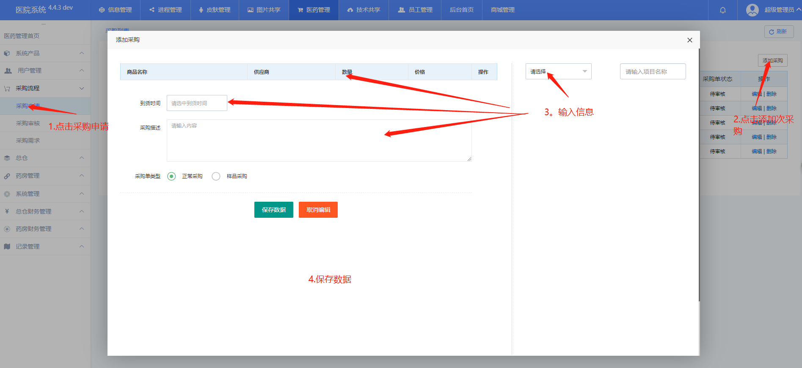
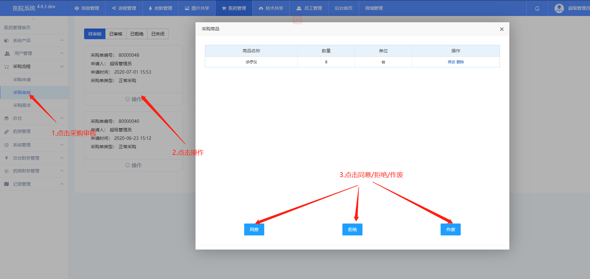
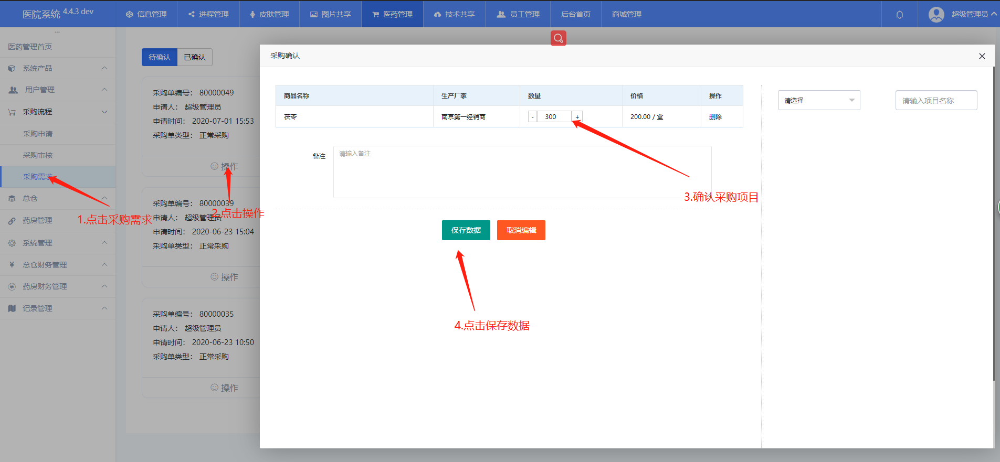
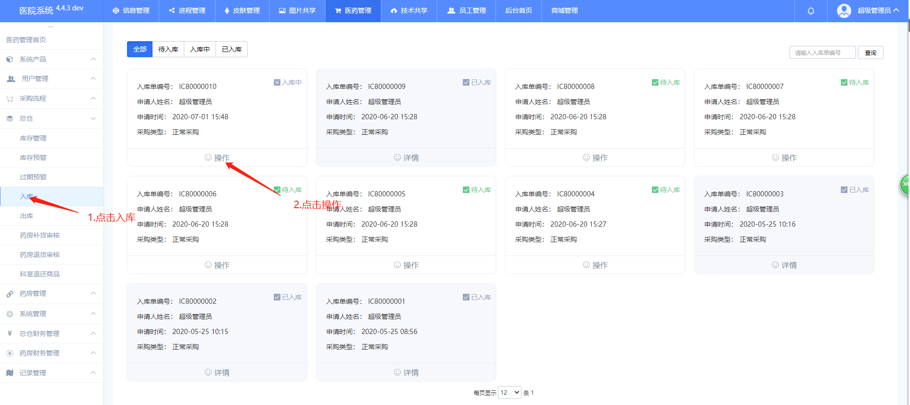
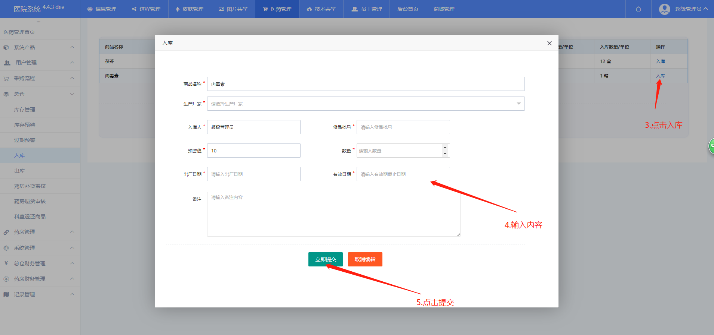
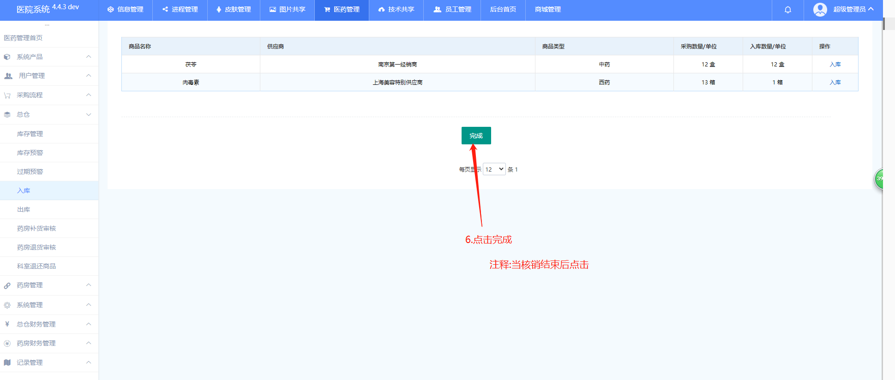
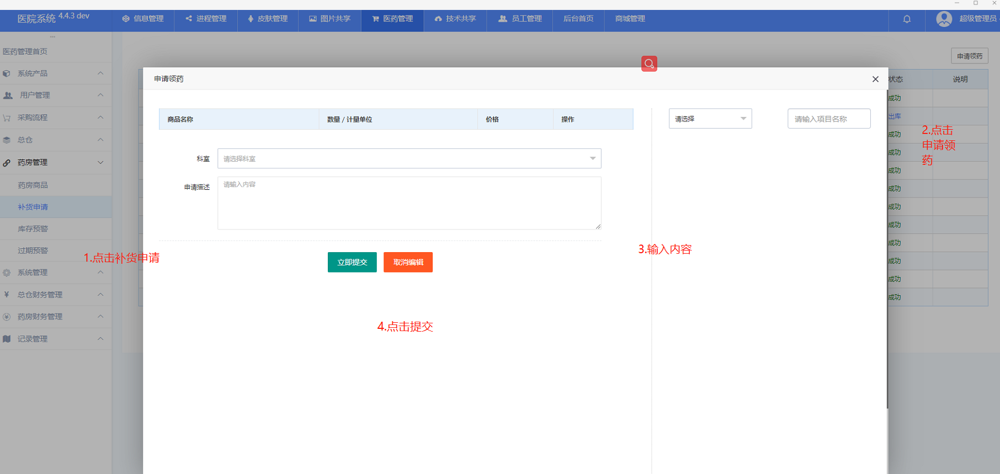
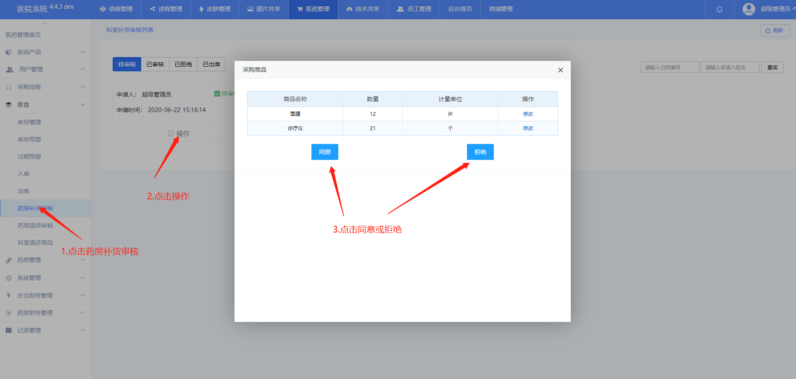
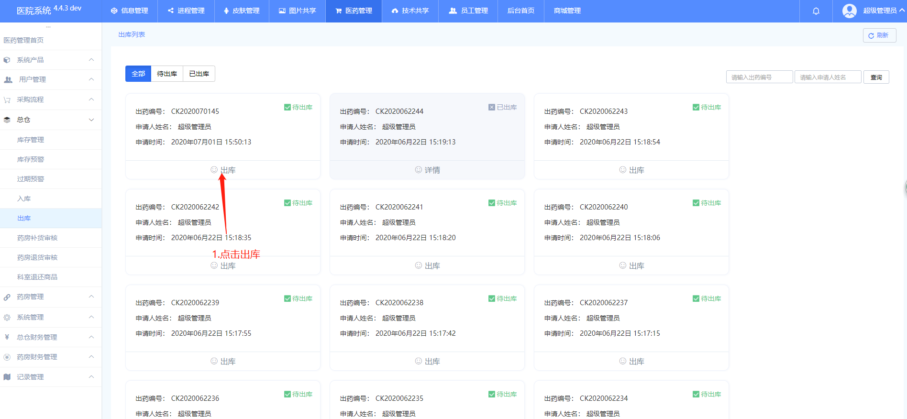
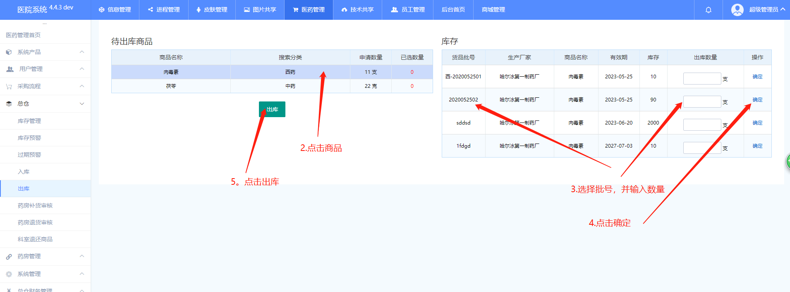

###### 河西美容医院系统文档<br><sup>仓库管理</sup><br>──<br>**张寒**<br>*2020-06-29*

[TOC]

# 流程

## 添加采购申请

- 权限：仓管

- 描述：

  ```javascript
  当仓库的耗材不足时需要添加采购
  ```

- 操作

  - 添加采购

    1. 点击采购申请

    2. 点击添加采购

    3. 输入信息

    4. 点击保存数据

    5. 图例

       

## 采购审核

- 权限：超管

- 描述:

  ```javascript
  添加玩采购之后有超管进行审核，主要确认采购需求是否合理。超管可以同意拒绝、作废
  同意：就是同意采购申请，
  拒绝：就是不同意这条条采购申请
  作废:就是终止这条采购单
  ```

- 操作

  - 采购审核

    1. 点击采购审核

    2. 点击操作

    3. 点击同意/拒绝/作废

    4. 图例

       

## 采购需求

- 权限：采购经理

- 描述：

  ```
  采购需求是仓库申请采购超管审核通过这时采购申请单推送到采购需求采购经理根据采购需求进行采购
  ```

  

- 操作

  - 操作

    1. 点击采购需求

    2. 点击操作

    3. 确认采购商品

    4. 点击保存数据

    5. 图例

       

  

  

## 入库

- 权限：超管

- 描述

  ```javascript
  1.当采购经理确认采购后采购单推回入库单进行入库操作
  ```

- 操作

  - 入库

    1. 点击入库

    2. 点击操作

    3. 点击入库

    4. 输入内容

    5. 点击提交

    6. 入库完成后点击完成

    7. 图例

       

       

       

       

       

## 科室发起补货申请

- 权限：科室

- 描述；

  ```javascript
  科室如果需要耗材可以同过发起补货申请，经过审核，方可去仓库领取，主要操作申请补货
  ```

- 操作

  - 申请领药

    1. 点击补货申请

    2. 点击申请领药

    3. 输入内容

    4. 点击提交

    5. 图例

       

  

## 药房补货审核

- 权限：院办

- 描述：

  ```
  当科室发起补货审核后由院长审核审核成功之后方可去库房领取
  ```

- 操作

  - 药房补货审核

    1. 点击药房捕获审核

    2. 点击操作

    3. 点击同意或拒绝

    4. 图例

       

## 出库

- 权限；仓管

- 描述

  ```
  院长审核成功之后
  仓库收到申请开始出库
  ```

- 操作

  - 出库

    1. 点击出库

    2. 选中商品

    3. 选择批号并输入数量

    4. 点机确定

    5. 点击出库

    6. 图例

       

       


###### END