###### 在这填写你的文档标题<br><sup>在这填写你的文档副标题（可选）</sup><br>──<br><sup>也可以在此填写一些额外的信息（可选）</sup><br><br><br>**在这填写作者**<br>*在这填版权信息*

[TOC]

# 流程

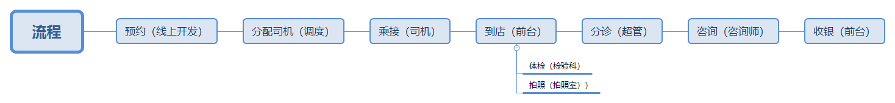

## 预约

- 描述：

  ```javascript
  此流程为线上开发在手机上预约客户预约完成后由调度分配司机
  ```

  

## 分配司机

- 权限：调度

- 描述：

  ```javascript
  当开发预约客户后再预约当天需要司机去机场或车站承接，在接送之前需要由调度分配司机
  调度得责任主要就是分配司机和修改司机。
  ```

  

- 操作：

  - 点击**待分配客户**查看所有的预约客户，

    - 给预约客户分配司机

      1. 点击分配司机

      2. 选择司机

      3. 点击确定

      4. 图解

         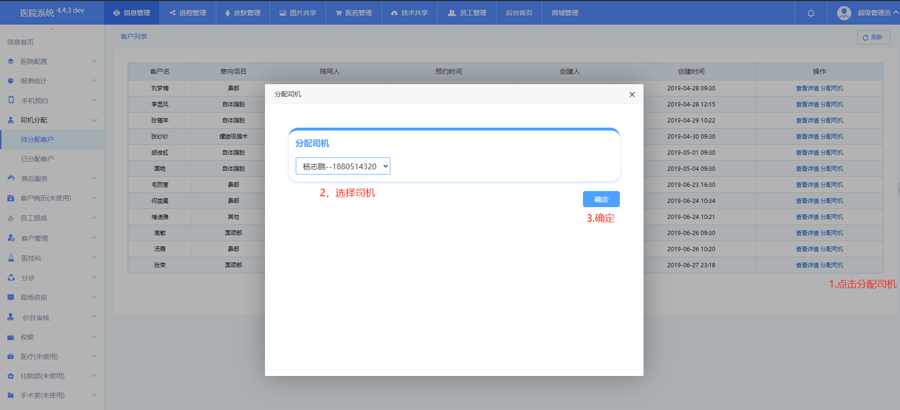

    - 查看详情（查看客户的相关信息）

      1. 点击查看详情

      2. 图解

         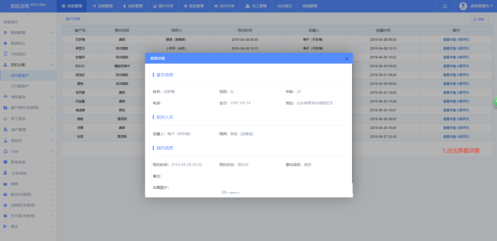

  - 分配完的客户调度可以查看**已分配客户**

    - 1. 点击已分配客户

      2. 如果司机临时有事我们可以**修改司机**

         - 点击修改司机

         - 选择司机

         - 点击确定

         - 图解如下

           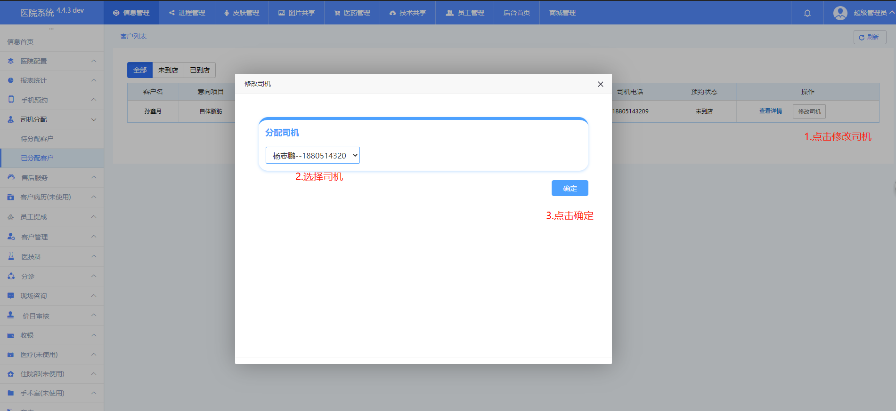

      3. 同样我们可以查看客户预约详情

## 承接

- 手机端查看


## 到店

- 权限：前台

- 描述：

  ```javascript
  当司机把客户接到医院后，首先到前台确认到店，如果客户没有通过预约，而是直接来店就不能直接确认，而是要先添加客户，然后确认，
  确认完到店，需要打印条形码
  ```

- 操作

  - 预约到店

    1. 点击确认

    2. 点击同通过

       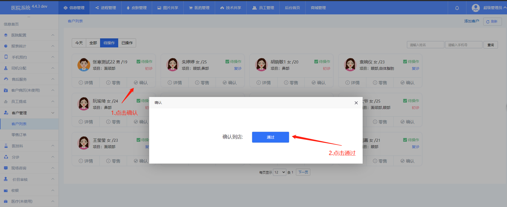

  - 直接到店

    1. 点击添加客户

    2. 输入信息

    3. 点击提交

    4. 同预约到店

    5. 图例：

       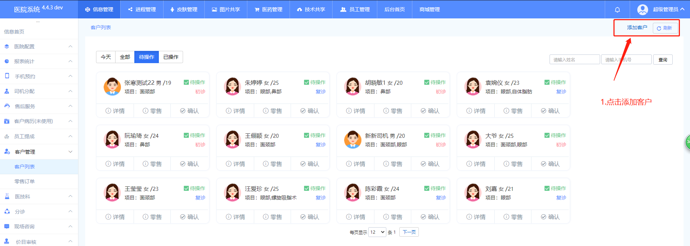

        

       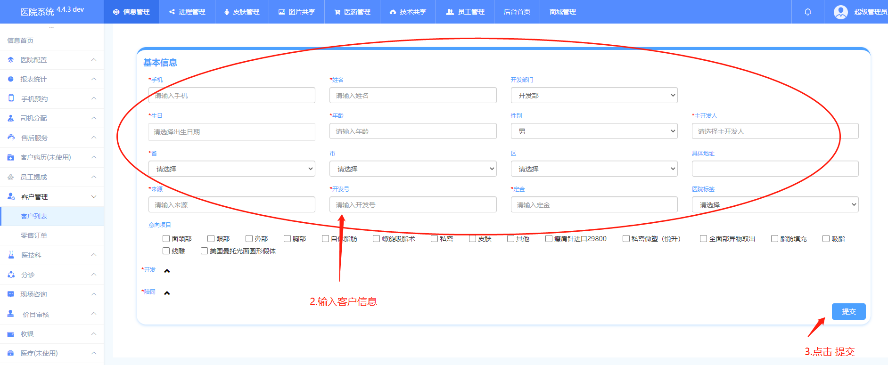

  - 打印

    1. 点击打印

    2. 在点击打印

    3. 在点击打印

    4. 点击确定

       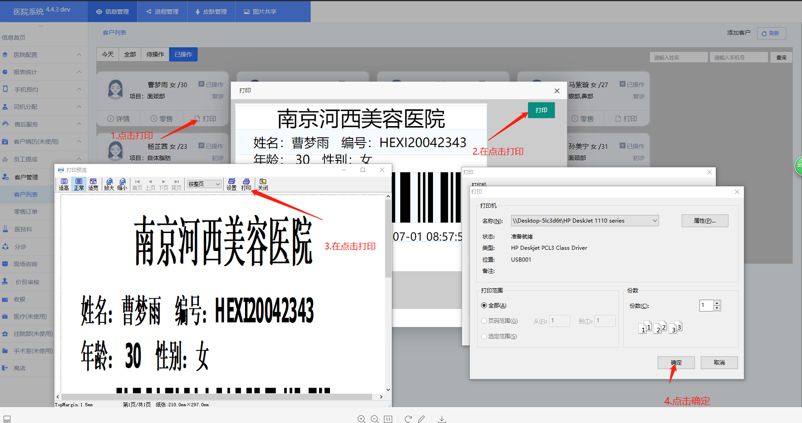

     

  - 零售：（此功能暂未使用）

    

## 拍照

- 权限：拍照室

- 描述：

  ```
  客户到店后第一步需要拍术前照，拍照的主要目的 1是方便咨询师查看，2.是后期做对比图， 3.是存档
  拍照室拍完照片需要上传术前照在后期咨询的时候
  ```

- 操作：

  - 术前照上传

    1. 点击术前照

    2. 点击上传术前照

    3. 选择图片

    4. 点击打开

    5. 点击保存

    6. 图例

       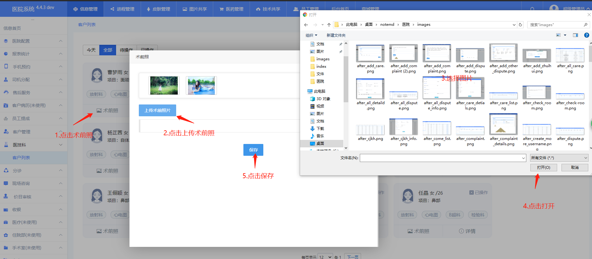

       

       

       

       

## 体检

- 权限：检验科

- 描述；

  ```javascript
     拍完照片客户需要体检查看客户身体状况是否适合做相关手术，检查完之后需要把照片传入系统，
  之前需要手动上传上传方式同拍照科，唯一区别需要使用高拍仪，但现在并不重要。因为现在是自动上传。
  所以这一步完全不用任何操作。
  ```

  

## 分诊

- 权限：超管

- 描述

  ```
    当客户在前台操作到店之后，直接到分诊这边开始分诊也就是分配咨询师
  按道理来说客户到店之后，要拍照，然后体检，接着才到分诊，那为什么会直接跳到分诊，原因是考虑到有的客户不愿意拍照，和体检，
  只想咨询。所有就成现在的样子了。分诊的主要功能是分配咨询师，和在分配错误的情况下修改咨询师
  ```

- 操作

  - 分诊

    1. 点击分诊

    2. 选择咨询

    3. 点击通过

    4. 图列

       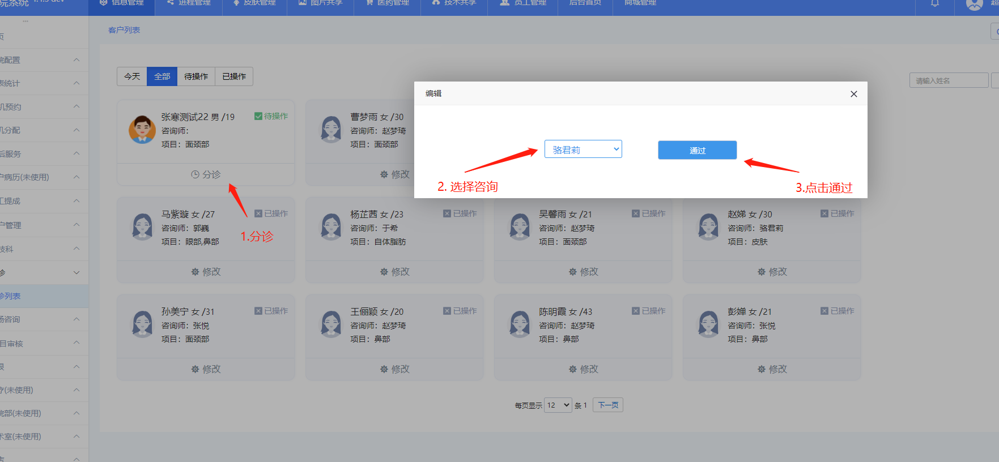

  - 修改

    1. 点击修改

    2. 选择咨询

    3. 点击通过

    4. 图列

       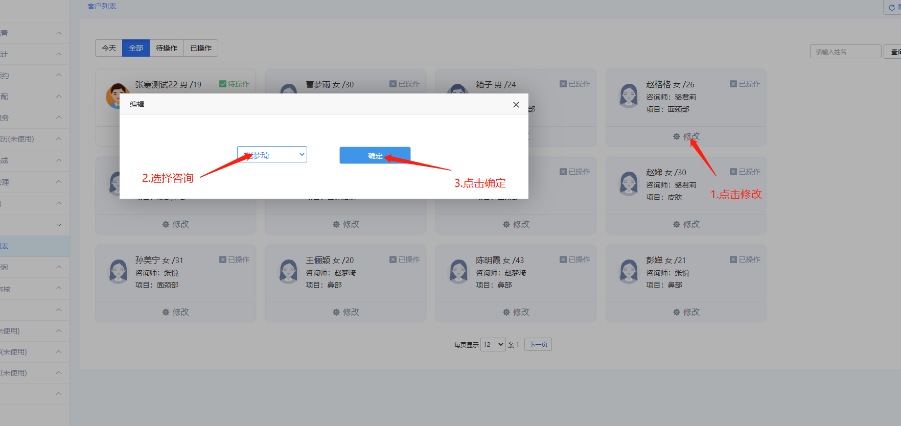


## 咨询

- 权限：咨询师

- 描述：

  ```javascript
  当超管把客户分给咨询师后，咨询师这时就要开始接待咨询了，
  咨询的主要目的只有一个，那就是开单，但是从操作系统的层面讲
  咨询师这时只需要点击接待然后添加项目，选择客户要做的项目然后还可以给折扣
  如果不给折扣价那么价格就是原价然后点击确定按钮
  操作成功之后这条订单推到超管由超管进行价目审核
  审核之后打印项目单，由顾客进行签字画押
  最后有一个注意点：
  	咨询师在点击咨询的时候是需要录视频的所以咨询师需要打开录屏软件这时录屏软件上会显示咨询师的名字和顾客的名字方可开始咨询
  ```

- 操作

  - 接待

    1. 点击接待

    2. 点击添加项目

    3. 选择项目

    4. 折后价和备注（不是必须操作）

    5. 点击确认

    6. 图例

       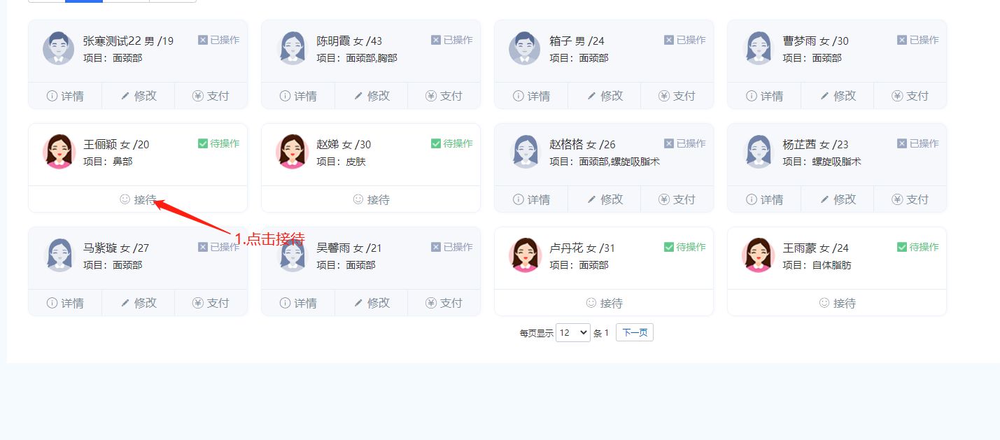

        

       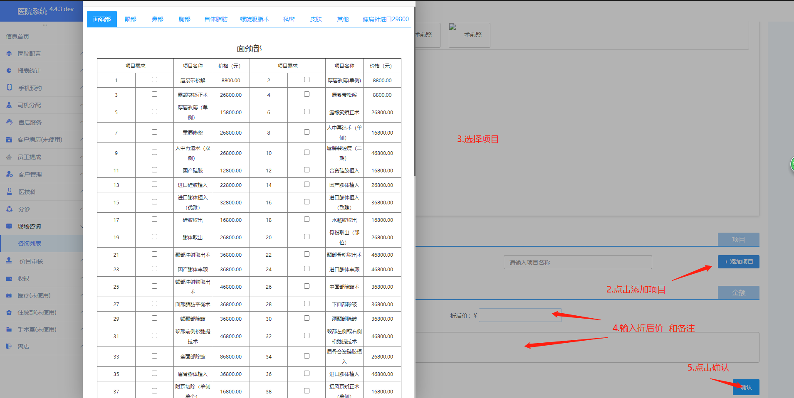

  - 打印

    1. 点击打印列表

    2. 找到客户点击打印

    3. 再次点击打印

    4. 点击打印

    5. 点击确定

    6. 图例

       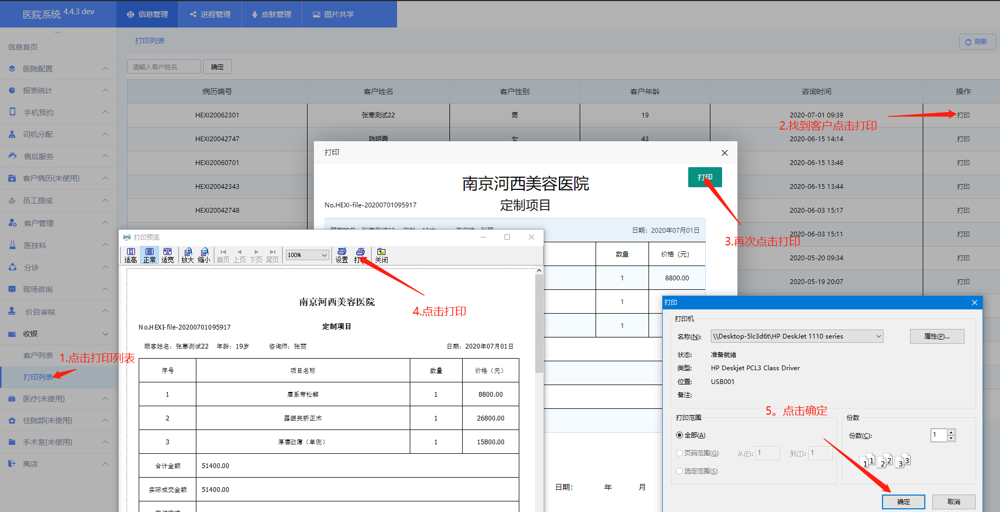

    

    

## 收银

- 权限：前台

- 描述:

  ```
  当顾客签完项目单，就到了最振奋人心得时刻了--付钱，
  前台开始收银；顾客得支付方式有支付宝，微信，现金，刷卡以及分期
  如果收银成功之后，超管更改价格，那就需要再次收银
  ```

- 操作

  - 收银

    1. 点击收银

    2. 选择支付方式输入金额（备注，贷款期数，还款日期）

    3. 点击确认

    4. 图例

       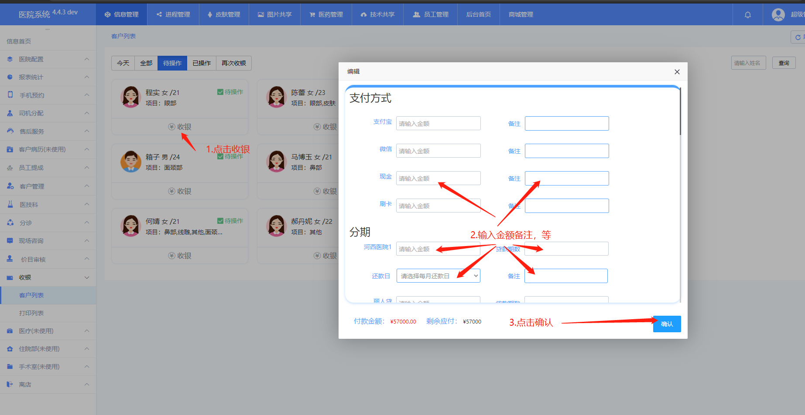

  - 再次收银

    1. 点击变更
    2. 根据剩余金额进行相关操作多退少补（同收银）


## 售后

- 权限；售后

- 描述

  ```
  售后是一个庞大且复杂得一个部门
  主要责任处理售后得所有事情包括：术后跟进，贷款客户催款，成交客户得等级设置，纠纷得记录和处理，客户投诉，客诉处理，入院记录，咨询视频，播放记录，通话记录
  成交客户：查看所有付款客户，这里可以设置客户等级。
  贷款客户：查看所有贷款得客户为贷款客户添加还款记录及查看还款记录，查看客户的分期明细，如果时间到了未还款，可以催款，催款成功之后要添加追回，并到还款明细中添加还款
  术后跟进：主要给术后2，7, 15，天的客户进行术后回访。查看顾客的纠纷，关怀，通话，记录，及术后关怀说明
  纠纷记录；查看在术后跟进当中添加的所有纠纷
  关怀记录：查看所有关怀
  追回记录：查看所有追回的记录
  来院客户：查看所有在前台等记到店的客户
  其他纠纷：
  客户投诉；客户投诉我们工作人员（投诉）
  客诉处理：客诉处理记录
  入院记录：所有做手术的顾客
  咨询视频：所有咨询师咨询的视频(在接待时录制视频)
  播放记录：所有视频播放的记录
  增加多人记录；
  通话记录：术后跟进打电话的所有录音
  ```

- 操作；

  - 查看成交客户并设置等级

    1. 点击成交客户

    2. 点击设置等级

    3. 选择等级/输入备注

    4. 点击通过

    5. 图例

       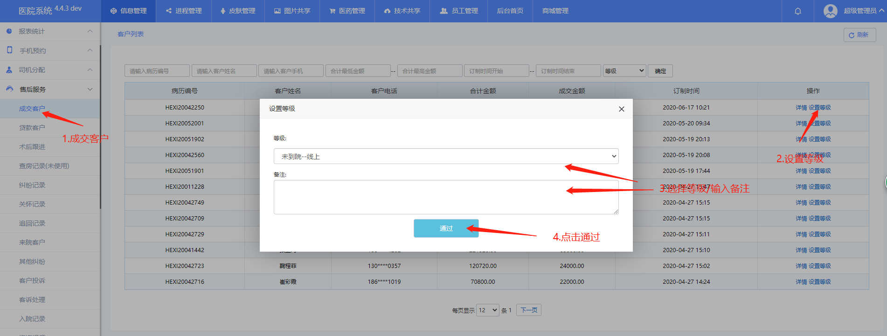

  - 查看所有贷款客户并查看还款明细并添加还款

    1. 点击贷款客户

    2. 点击还款明细

    3. 点击添加还款

    4. 输入内容

    5. 点击提交

    6. 图例

       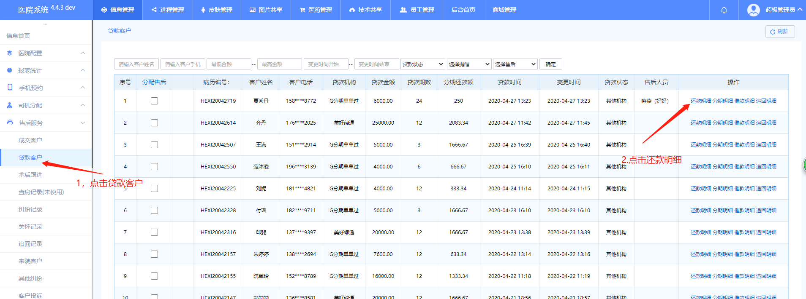

        

       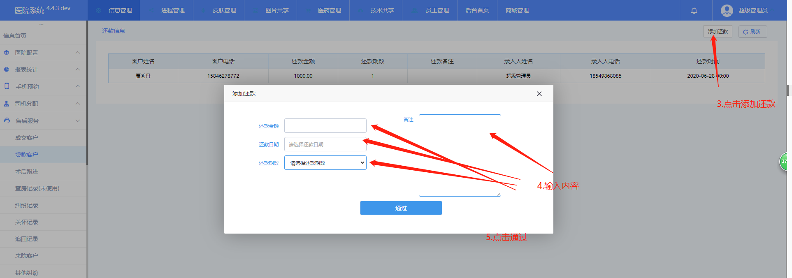

  - 分配售后

    1. 点击贷款客户

    2. 选择客户

    3. 点击分配售后

    4. 选择售后

    5. 点击确定

    6. 图例

       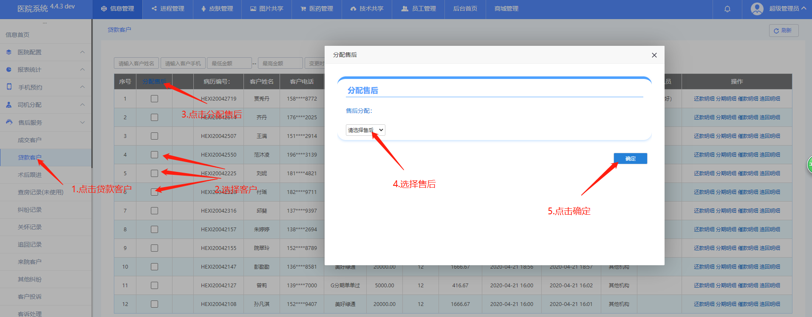

  - 查看所有贷款客户并查看分期明细，催款，和添加追回

    1. 点击贷款客户

    2. 点击分期明细

    3. 点击催款/添加追回

    4. 输入信息

    5. 点击确定

    6. 图例

       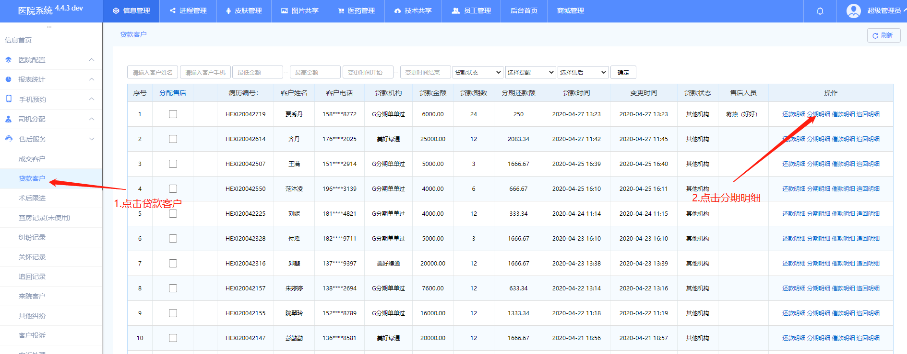

       

       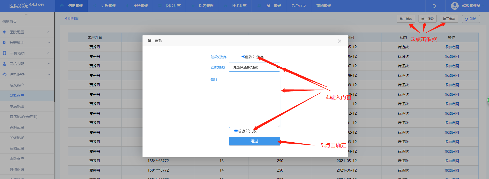

       

       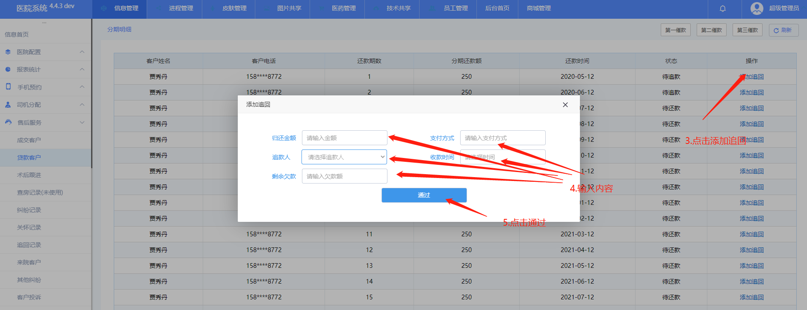

  - 查看所有贷款客户并查看催款明细，

    1. 点击贷款客户

    2. 点击催款明细

    3. 图例

       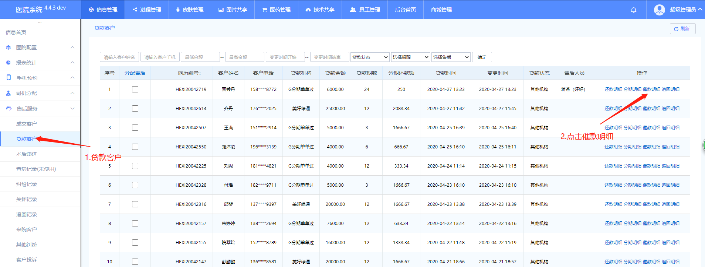

  - 查看所有贷款客户并查看追回明细

    1. 点击贷款客户

    2. 点击追回明细

    3. 图例

       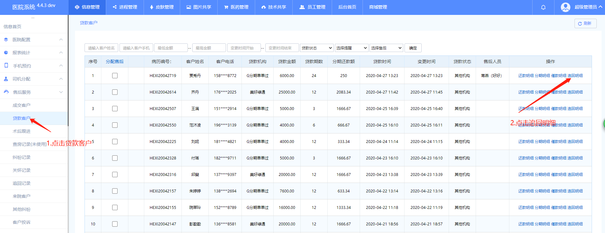

  - 术后跟进拨打电话

    1. 点击详情

    2. 点击电话按钮

    3. 图例

       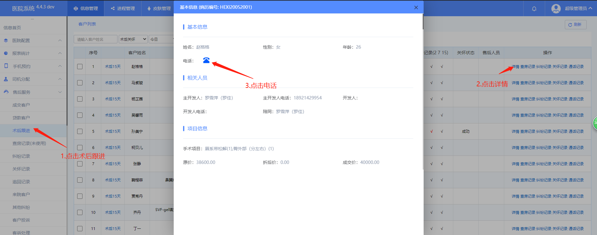

  - 记录关怀说明（此操作在拨打电话之后）

    1. 点击术后（2/7/15）

    2. 输入说明

    3. 点击确定

    4. 图例

       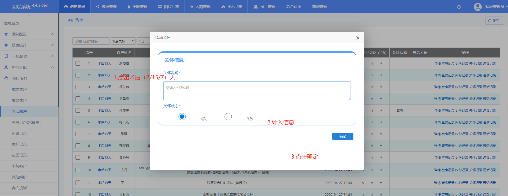

    

  - 来院客户：查看所有在前台等记到店的客户并修改基本信息，

    1. 点击来源客户

    2. 点击修改

    3. 修改信息

    4. 点击提交

    5. 图例

       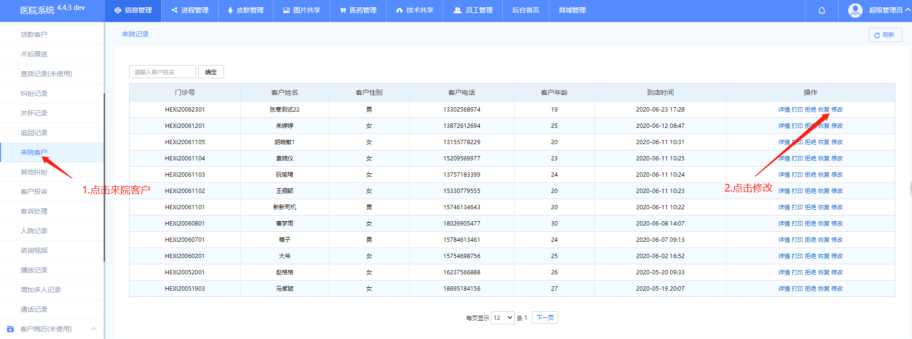

       

       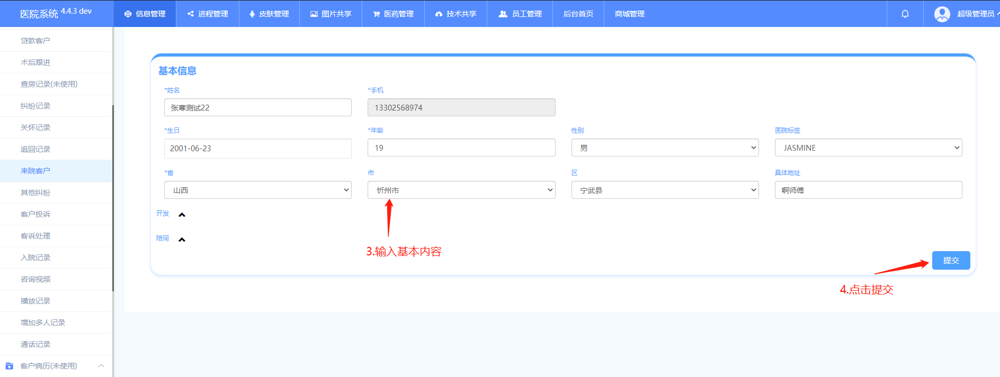

  - 拒绝流程，

    1. 点击来源客户

    2. 点击拒绝

    3. 输入内容

    4. 点击确认

    5. 图例

       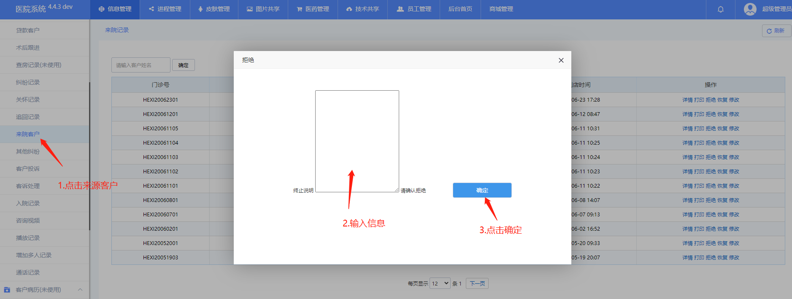

  - 恢复流程，

    1. 点击来源客户

    2. 点击恢复

    3. 点击确认

    4. 图例

       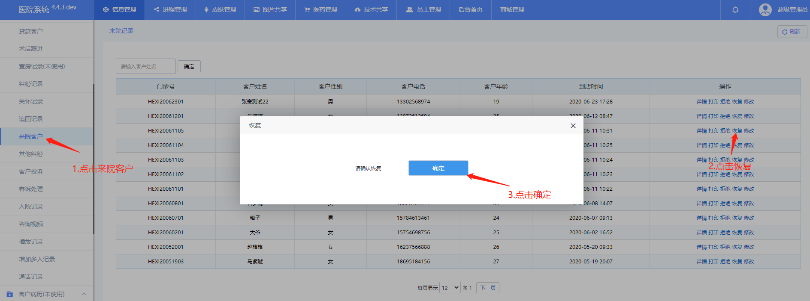

  - 打印自媒体号

    1. 点击来源客户

    2. 点击打印

    3. 图例

       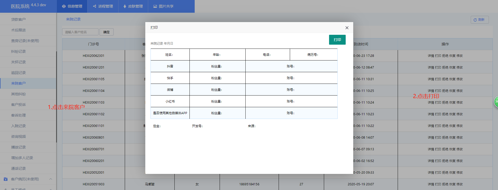

  - 添加其他纠纷：记录特殊纠纷

    1. 点击其他纠纷

    2. 点击其他纠纷按钮

    3. 输入内容

    4. 点击确认

    5. 图例

       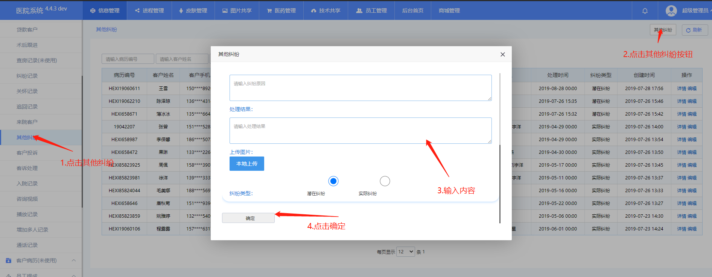

  - 编辑其他纠纷

    1. 点击其他纠纷

    2. 点击编辑

    3. 输入内容

    4. 点击确认

    5. 图例

       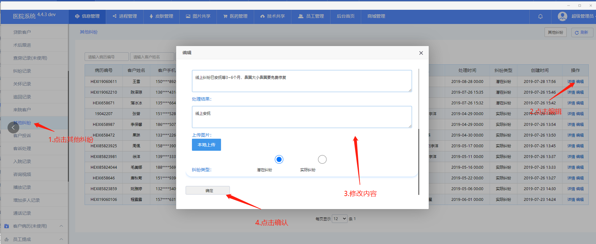

  - 客户投书添加客户投诉

    1. 点击客户投诉

    2. 点击添加投诉

    3. 输入内容

    4. 点击确认

    5. 图例

       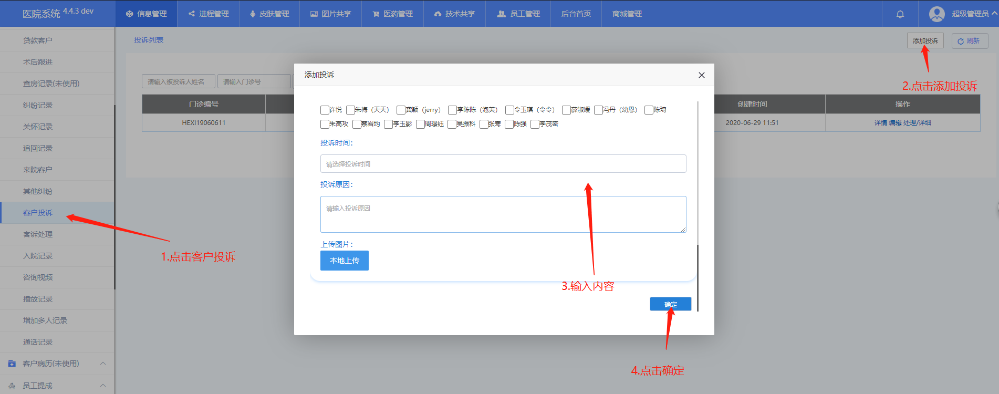

  - 编辑客户投诉

    1. 点击客户投诉

    2. 点击编辑

    3. 输入内容

    4. 点击确认

    5. 图例

       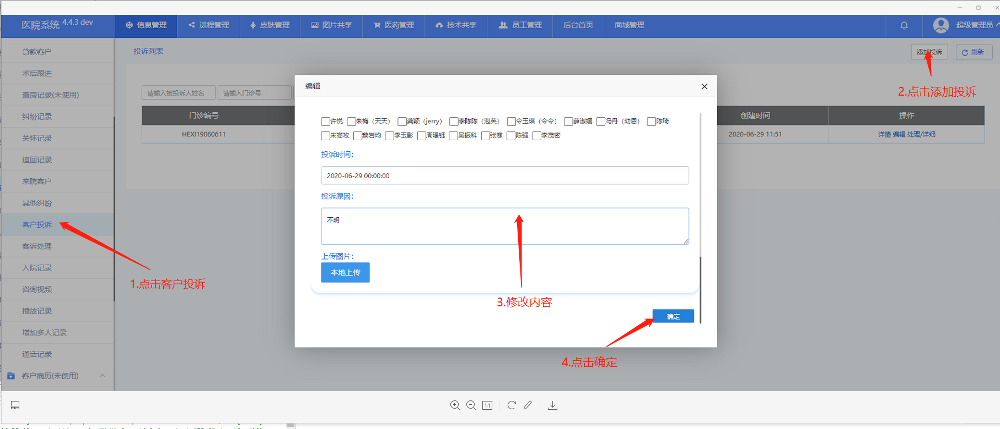

  - 处理客户投诉

    1. 点击客户投诉

    2. 点击处理/详细

    3. 输入内容

    4. 点击确认

    5. 图例

       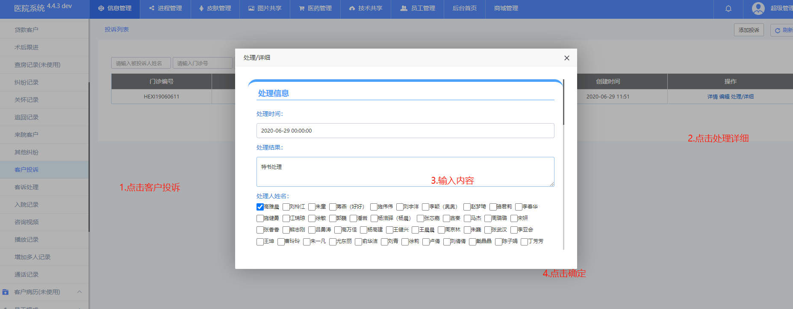

  - 客诉处理（处理客户投诉的记录）

    1. 点击客诉处理

  - 入院记录：所有做项目住院的记录

    1. 点击入院记录

  - 查看咨询视频

    1. 点击咨询视频

  - 查看播放记录

    1. 点击播放记录

  - 查看增加多人记录

    1. 点击增加多人记录

  - 查看通话记录

    1. 点击通话记录

  - 查看纠纷记录

    1. 点击纠纷记录

  - 查看关怀记录

    1. 点击关怀记录

    


###### 在这填文档结束语