###### 河西美容医院系统文档<br><sup>皮肤管理</sup><br>──<br>**张寒**<br>*2020-06-29*

[TOC]

# 皮肤项目
## 项目列表

- 描述：这里是皮肤科所有的项目管理
- 权限：超管
- 功能：
  - 添加项目
  - 修改项目
  - 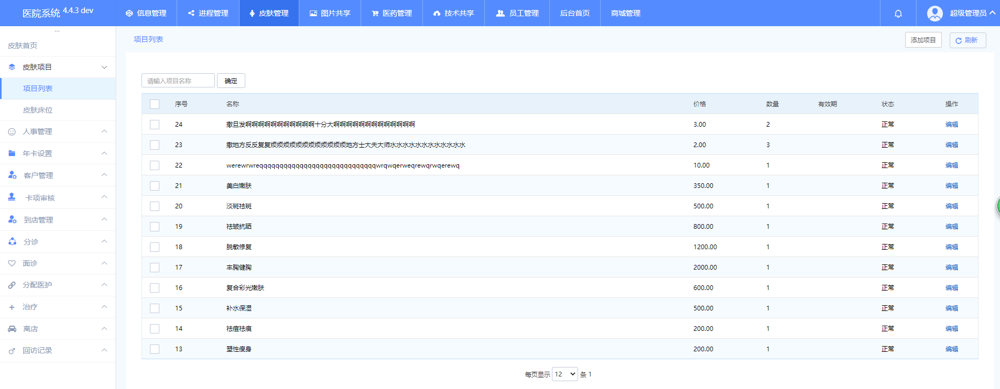
- 接口：
  - 添加项目
  
    - 界面：
  
      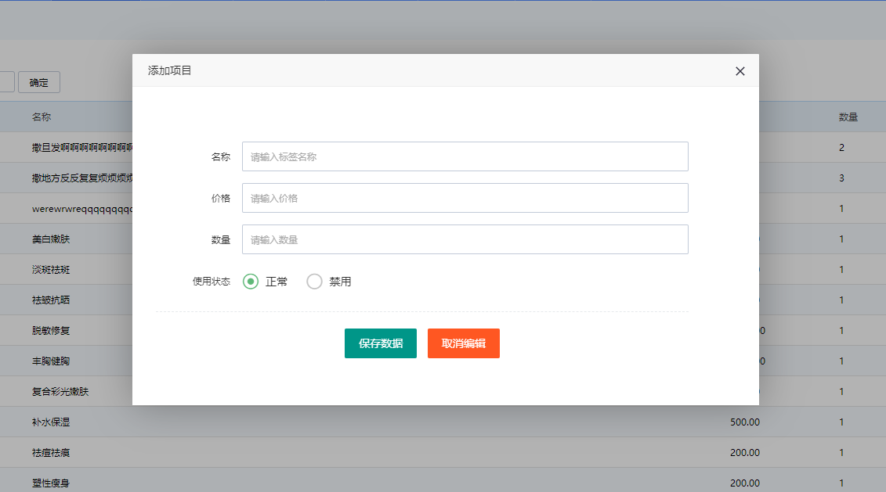
  
    - 请求方式：
  
    - 请求参数：
  
      | 参数 | 描述 | 必填 |
      | ---- | ---- | ---- |
      |      |      |      |
  
      
  
    - 请求参数示例：
  
      ```javascript
      
      ```
  
      
  
    - 返回值
  
  - 修改项目
  
    - 界面：
  
      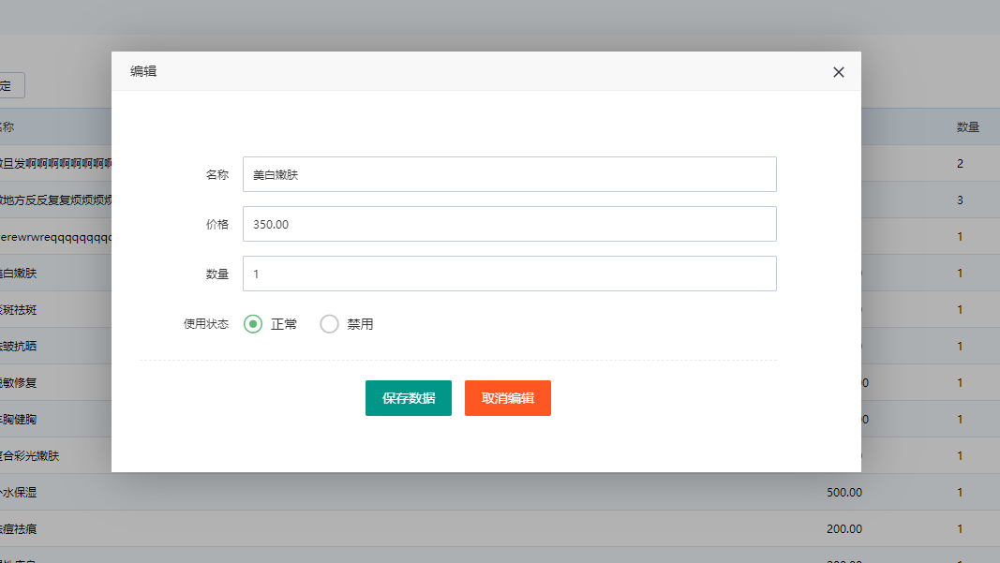
  
    - 请求方式：
  
    - 请求参数：
  
      | 参数 | 描述 | 必填 |
      | ---- | ---- | ---- |
      |      |      |      |
  
      
  
    - 请求参数示例：
  
      ```javascript
      
      ```
  
      
  
    - 返回值


##　皮肤床位

- 描述：这里是皮肤科床位管理（床位是用来管理客户来院数量的防止客户过多皮肤科消化不了）
- 权限：超管
- 功能：
  - 添加床位
  - 编辑床位
  - 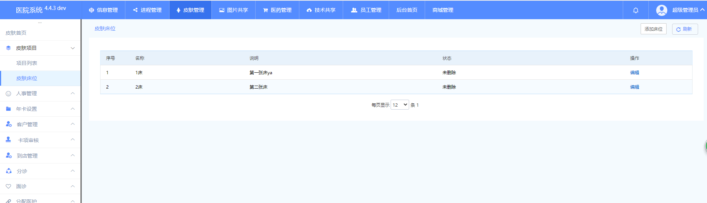
- 接口：
  - 添加床位
  
    - 界面：
  
      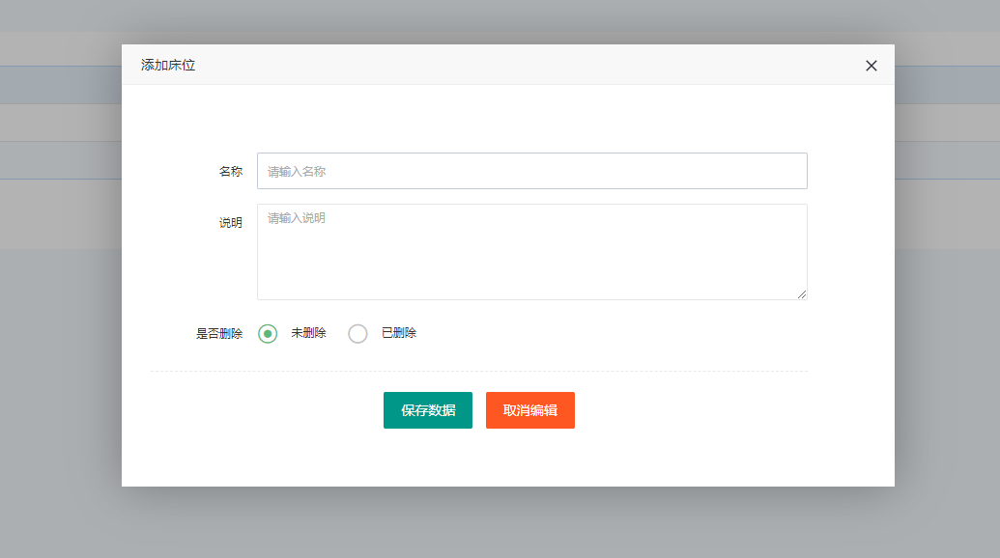
  
    - 请求方式：
  
    - 请求参数：
  
      | 参数 | 描述 | 必填 |
      | ---- | ---- | ---- |
      |      |      |      |
  
      
  
    - 请求参数示例：
  
      ```javascript
      
      ```
  
      
  
    - 返回值
  
  - 编辑床位
  
    - 界面：
  
      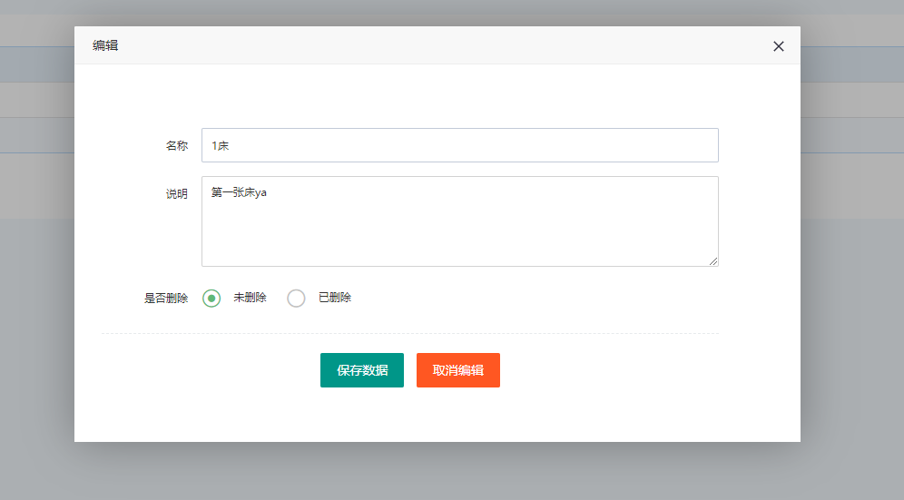
  
    - 请求方式：
  
    - 请求参数：
  
      | 参数 | 描述 | 必填 |
      | ---- | ---- | ---- |
      |      |      |      |
  
    - 请求参数示例：
  
      ```javascript
      
      ```
  
      
  
    - 返回值

# 人事管理

## 在职人员

# 年卡设置

## 年卡列表

- 描述： 皮肤科销售方式为打包捆绑式销售所以有了卡片.

- 权限：超管

- 功能：

  - 添加卡片
  - 编辑卡片
  - 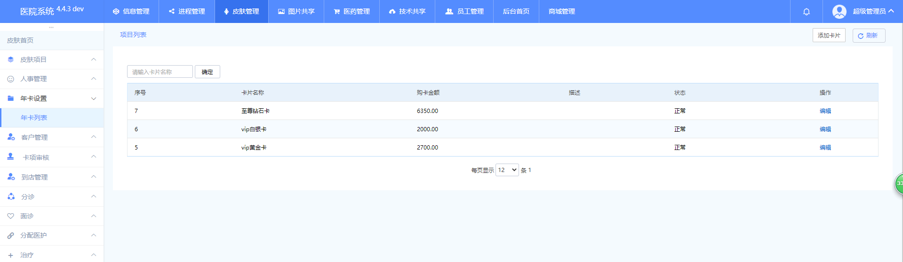

- 接口：

  - 添加卡片

    - 界面：

      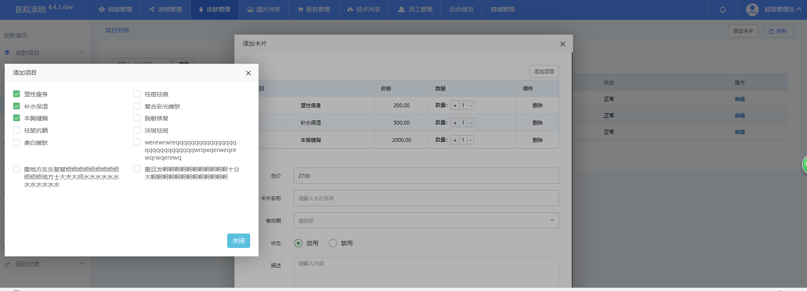

    - 请求方式：

    - 请求参数：

      | 参数 | 描述 | 必填 |
      | ---- | ---- | ---- |
      |      |      |      |

    - 请求参数示例：

      ```javascript
      
      ```

      

    - 返回值

  - 编辑卡片

    - 界面：

      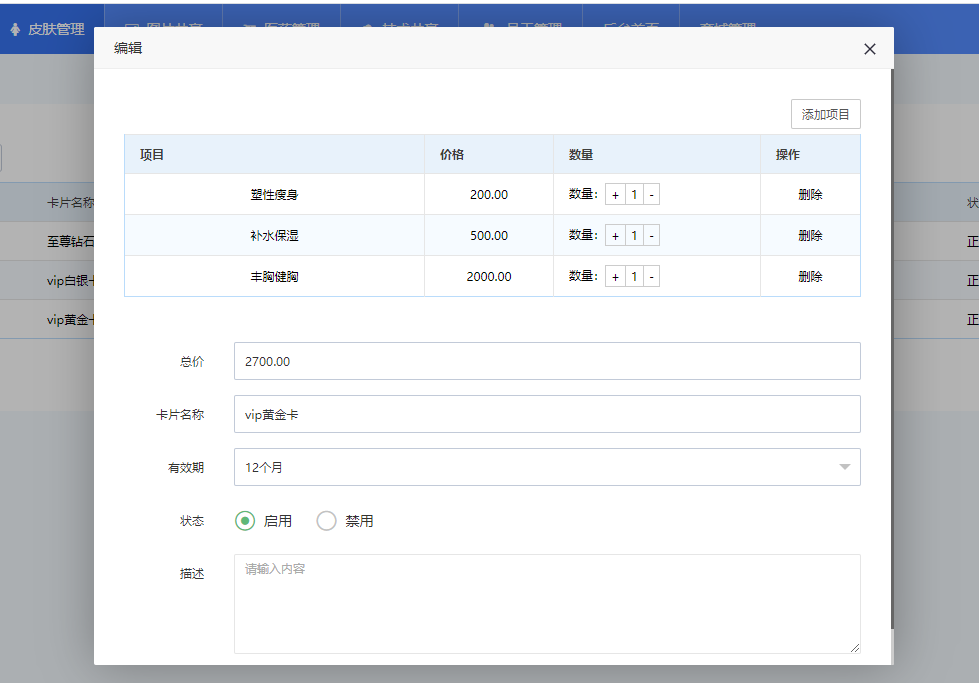

    - 请求方式：

    - 请求参数：

      | 参数 | 描述 | 必填 |
      | ---- | ---- | ---- |
      |      |      |      |

    - 请求参数示例：

      ```javascript
      
      ```

      

    - 返回值

# 客户管理

## 购卡客户

- 描述：此处可以看到所有的购卡客户

- 权限；前台/超管

- 功能

  - 购卡
  - 编辑
  - 升卡
  - 图片
  - 续卡
  - 划扣
  - 详情
  - 划扣详情
  - 设置标签
  - 管理员划扣
  - 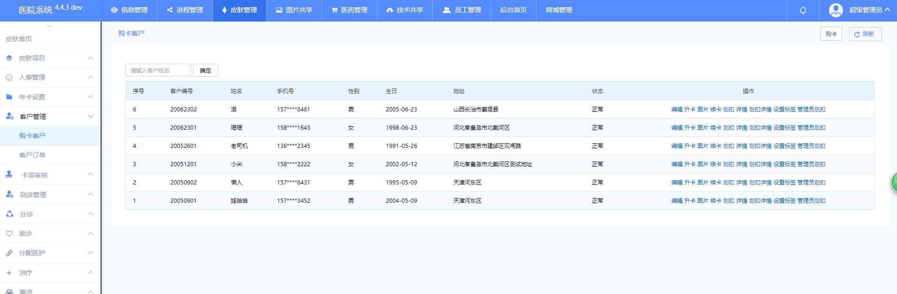

- 接口

  - 购卡：/pf/user/add.html

    - 界面：

      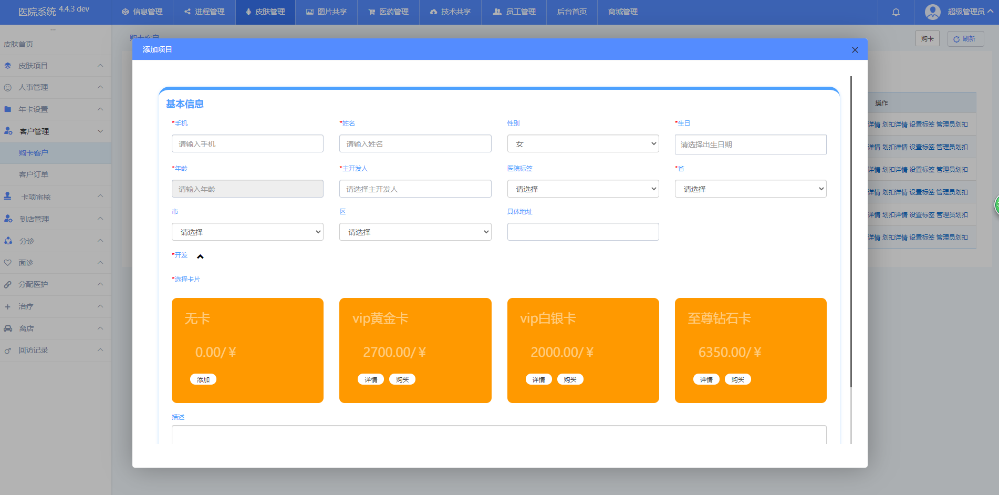

    - 请求方式：POST

    - 请求参数：

      | 参数             | 描述     | 必填 |
      | ---------------- | -------- | ---- |
      | phone            | 手机     | 是   |
      | username         | 姓名     | 是   |
      | sex              | 性别     | 是   |
      | birthday         | 生日     | 是   |
      | age              | 年龄     | 是   |
      | main_reg_user_id | 主开发人 | 是   |
      | user_type        | 医院标签 | 否   |
      | province         | 省       | 是   |
      | city             | 市       | 否   |
      | area             | 区       | 否   |
      | address          | 具体地址 | 否   |
      | reg_user_id      | 开发     | 是   |
      | card_id          | 卡片     | 是   |
      | name             | 卡片名称 | 是   |
      | price            | 卡价格   | 是   |
      | validity         | 卡有效期 | 是   |
      | empty_card       |          | 是   |
      | comments         | 描述     | 否   |

    - 请求参数示例：

      ```javascript
      {
          phone: 13305185973
          username: 张寒
          sex: 1
          birthday: 1960-06-29
          age: 60
          main_reg_user_id: 10252
          user_type: 4
          province: 天津
          city: 市辖区
          area: 河西区
          address: 山大佛挡杀佛
          reg_user_id[]: 10120
          card_id: 5
          name: vip黄金卡
          price: 2700.00
          validity: 12
          empty_card: 0
          comments: 测试
      }
      ```

      

    - 返回值

  - 编辑：/pf/user/edit.html?id=6&empty_card=0

    - 界面：

      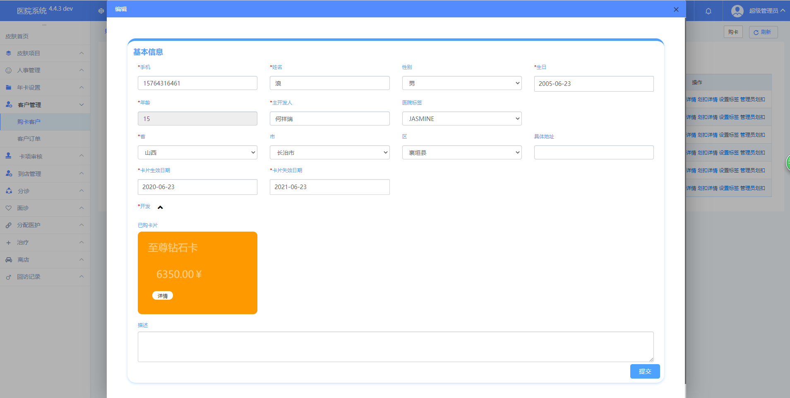

    - 请求方式：POST

    - 请求参数：

      | 参数             | 描述     | 必填 |
      | ---------------- | -------- | ---- |
      | phone            | 手机     | 是   |
      | username         | 姓名     | 是   |
      | sex              | 性别     | 是   |
      | birthday         | 生日     | 是   |
      | age              | 年龄     | 是   |
      | main_reg_user_id | 主开发人 | 是   |
      | user_type        | 医院标签 | 否   |
      | province         | 省       | 是   |
      | city             | 市       | 否   |
      | area             | 区       | 否   |
      | address          | 具体地址 | 否   |
      | reg_user_id      | 开发     | 是   |
      | card_id          | 卡片     | 是   |
      | name             | 卡片名称 | 是   |
      | price            | 卡价格   | 是   |
      | validity         | 卡有效期 | 是   |
      | empty_card       |          | 是   |
      | comments         | 描述     | 否   |

    - 请求参数示例：

      ```javascript
      {
          phone: 13305185973
          username: 张寒2
          sex: 2
          birthday: 2005-06-29
          age: 15
          main_reg_user_id: 10252
          user_type: 4
          province: 天津
          city: 市辖区
          area: 河西区
          address: 山大佛挡杀佛
          begin_date: 0100-01-01
          validity_date: 0100-01-01
          reg_user_id[]: 10120
          card_id: 5
          id: 7
          comments: 第三饭
      }
      ```

      

    - 返回值

  - 升卡：/pf/user/upgrade.html?id=7

    - 界面：

      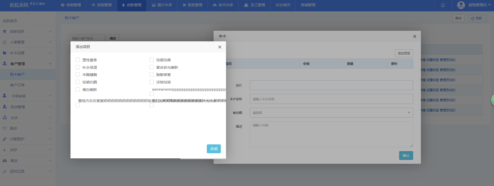

    - 请求方式：

    - 请求参数：

      | 参数          | 描述     | 必填 |
      | ------------- | -------- | ---- |
      | uid           |          | 是   |
      | comments      | 描述     | 否   |
      | name          | 卡名     | 是   |
      | project_id    | 项目id   | 是   |
      | project_name  | 项目名称 | 是   |
      | num           |          |      |
      | project_num   | 项目数量 | 是   |
      | project_price | 项目价格 | 是   |
      | price         | 总价     | 是   |
      | validity      | 有效期   | 是   |
      | is_bosom      |          |      |

    - 请求参数示例：

      ```javascript
      {
          uid: 7
          comments: 测试
          name: 不记名卡
          project_id: 13,15,17,
          project_name: 塑性瘦身,补水保湿,丰胸健胸,
          num: 1,1,1,
          project_num: 1,1,1,
          project_price: 200.00,500.00,2000.00,
          price: 2700
          validity: 12
          is_bosom: 1,1,1,
      }
      ```

      

    - 返回值：

  - 图片

    - 描述：查看visa上传的照片

    - 界面：

    - 请求方式：

    - 请求参数：

      | 参数 | 描述 | 必填 |
      | ---- | ---- | ---- |
      |      |      |      |

    - 请求参数示例：

      ```javascript
      
      ```

      

    - 返回值

  - 续卡

    - 界面：

      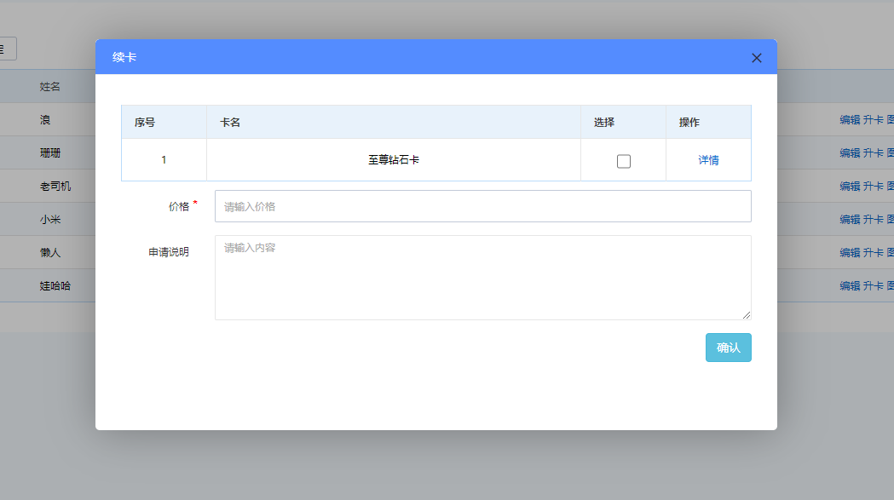

    - 请求方式：

    - 请求参数：

      | 参数          | 描述     | 必填 |
      | ------------- | -------- | ---- |
      | **pay_money** | 卡价格   | 是   |
      | comments      | 申请说明 | 否   |
      | uid           |          | 是   |
      | uc_id         |          | 是   |

    - 请求参数示例：

      ```javascript
      {
          pay_money: 2700.00
          comments: 测试续卡
          uid: 7
          uc_id: 9
      }
      ```

      

    - 返回值

      ```javascript
      {"code":1,"msg":"操作成功"}
      ```

      

  - 划扣

    - 界面：

      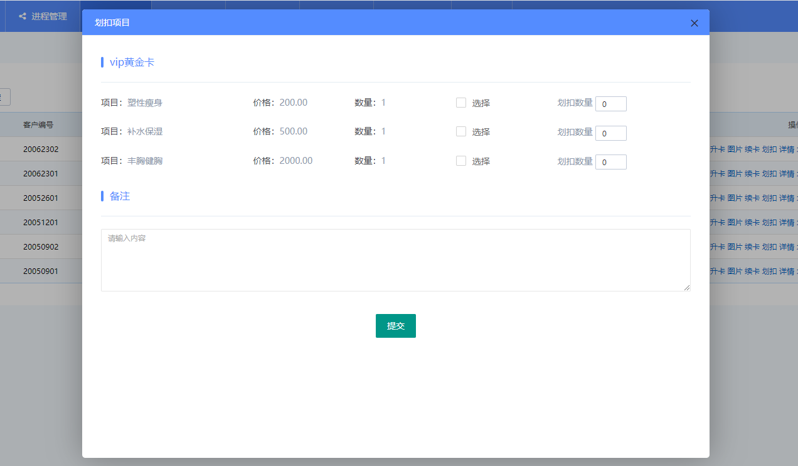

    - 请求方式：

    - 请求参数：

      | 参数 | 描述 | 必填 |
      | ---- | ---- | ---- |
      |      |      |      |

    - 请求参数示例：

      ```javascript
      
      ```

      

    - 返回值

  - 详情

    - 界面：

      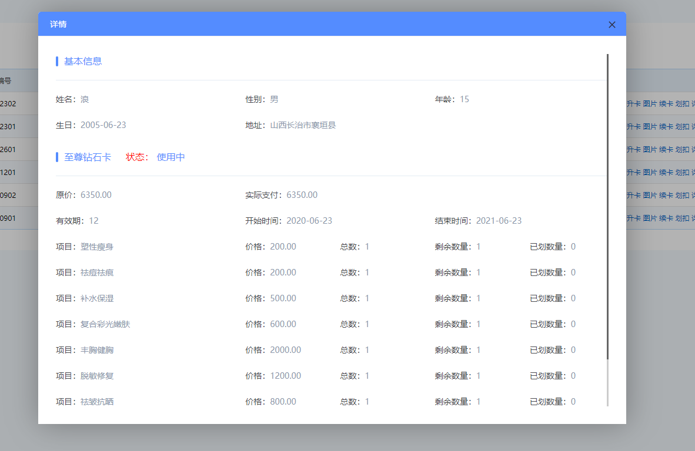

    - 请求方式：

    - 请求参数：

      | 参数 | 描述 | 必填 |
      | ---- | ---- | ---- |
      |      |      |      |

    - 请求参数示例：

      ```javascript
      
      ```

      

    - 返回值

      

      ```php
      
      ```

      

  - 划扣详情

    - 界面：

      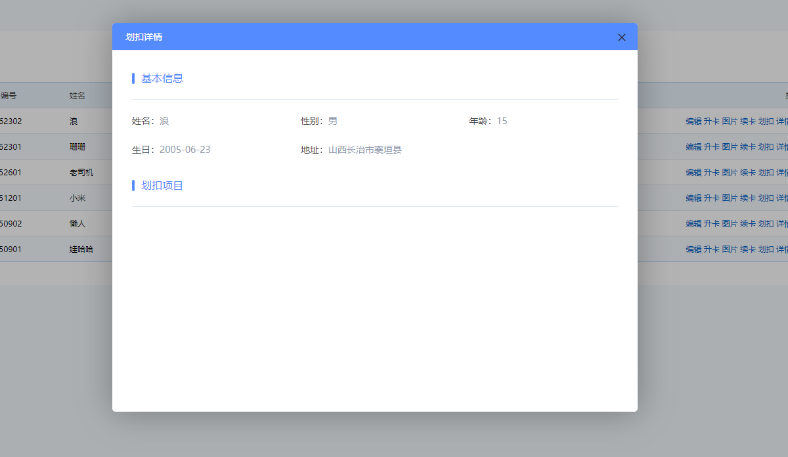

    - 请求方式：

    - 请求参数：

      | 参数 | 描述 | 必填 |
      | ---- | ---- | ---- |
      |      |      |      |

    - 请求参数示例：

      ```javascript
      
      ```

      

    - 返回值

      

      ```php
      
      ```

      

  - 设置标签

    - 界面：

      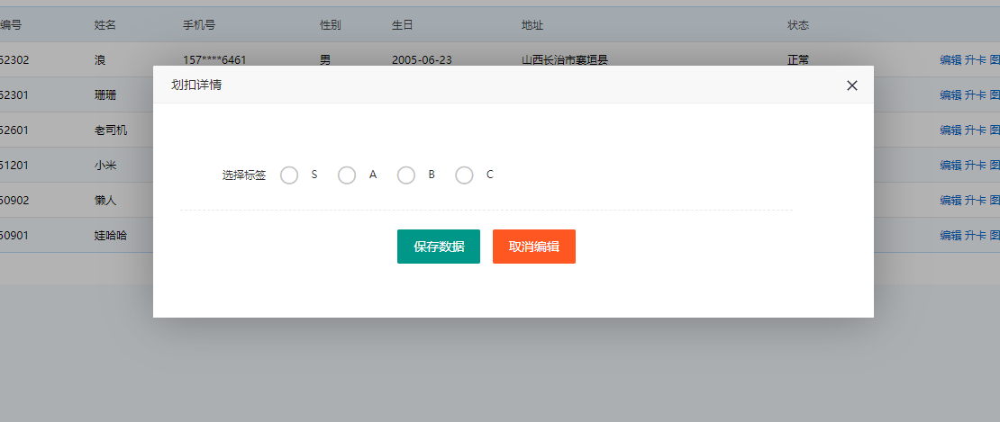

    - 请求方式：

    - 请求参数：

      | 参数 | 描述 | 必填 |
      | ---- | ---- | ---- |
      |      |      |      |

    - 请求参数示例：

      ```javascript
      
      ```

      

    - 返回值

  - 管理员划扣

    - 界面：

      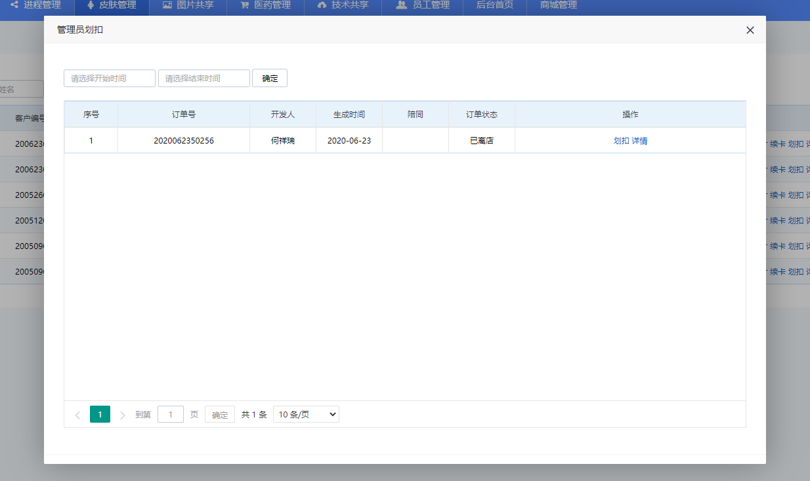

       

      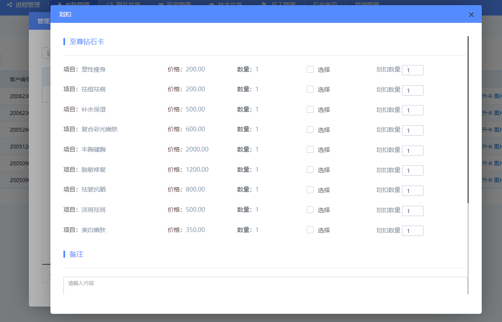

       

      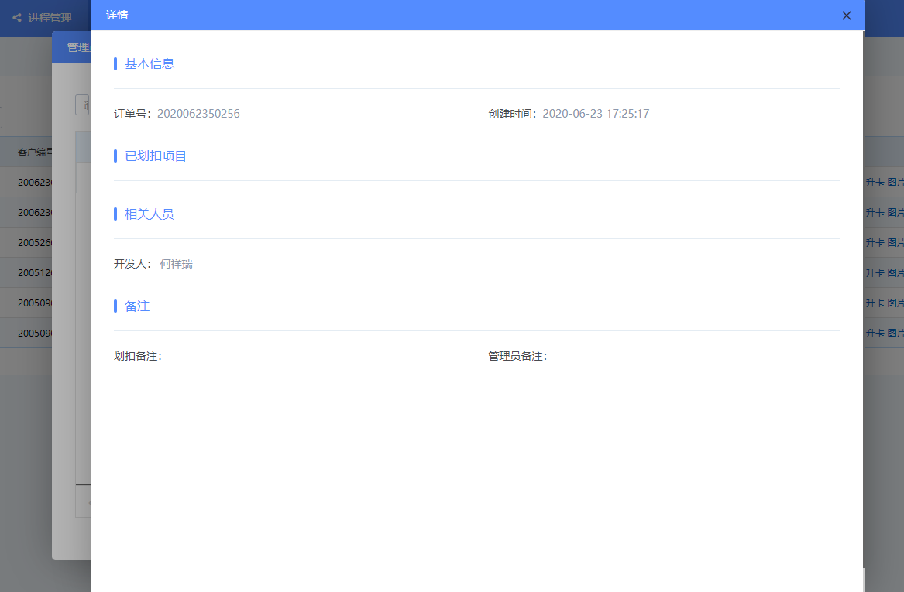

    - 请求方式：

    - 请求参数：

      | 参数 | 描述 | 必填 |
      | ---- | ---- | ---- |
      |      |      |      |

    - 请求参数示例：

      ```javascript
      
      ```

      

    - 返回值

## 客户订单

- 权限：前台/超管

- 功能:

  - 查看详情
  - 取消订单
  - 

- 接口

  - 查看详情

    - 界面：

      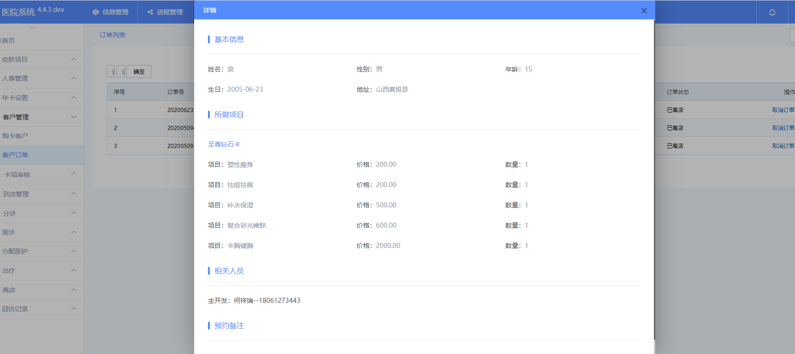

    - 请求方式：

    - 请求参数：

      | 参数 | 描述 | 必填 |
      | ---- | ---- | ---- |
      |      |      |      |

    - 请求参数示例：

      ```javascript
      
      ```

      

    - 返回值

      

      ```php
      
      ```

      

  - 取消订单

    - 界面：

      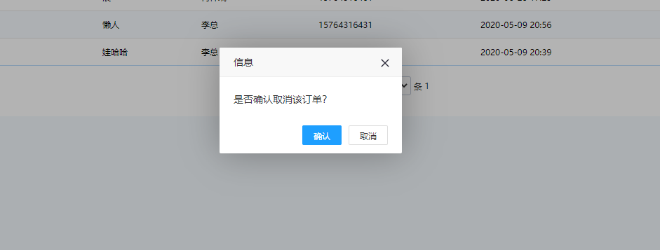

    - 请求方式：

    - 请求参数：

      | 参数 | 描述 | 必填 |
      | ---- | ---- | ---- |
      |      |      |      |

    - 请求参数示例：

      ```javascript
      
      ```

      

    - 返回值


# 卡项审核

## 购卡审核

- 权限：超管

- 功能：

  - 审核
  - 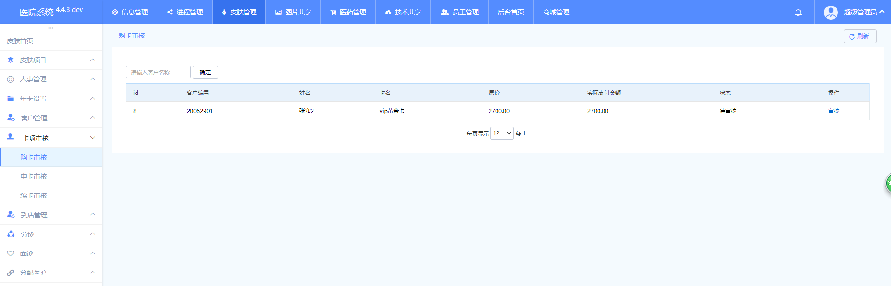

- 接口

  - 审核：/pf/audit/add.html?id=8

    - 界面：

      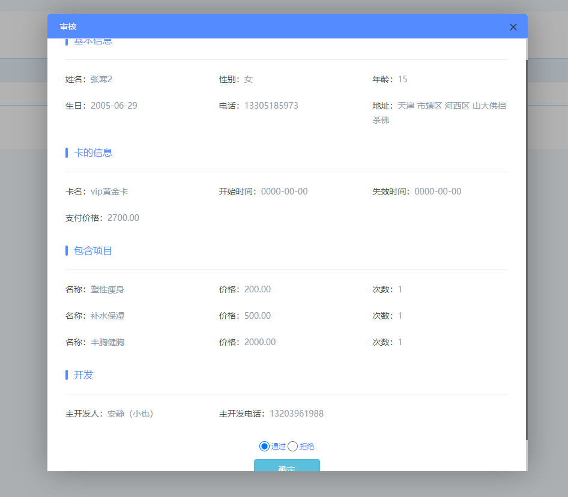

    - 请求方式：POST

    - 请求参数：

      | 参数  | 描述                     | 必填 |
      | ----- | ------------------------ | ---- |
      | state | 状态（1是同意  2是拒绝） | 是   |
      | id    |                          |      |

    - 请求参数示例：

      ```javascript
      {
          state: 1
      	id: 8
      }
      ```

      

    - 返回值

## 升卡审核

- 权限：超管

- 功能：

  - 审核
  - 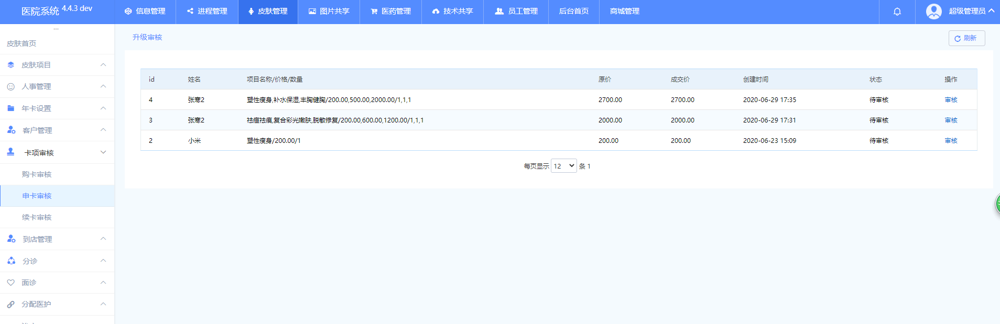

- 接口

  - 审核：/pf/audit/check.html?id=3

    - 界面：

      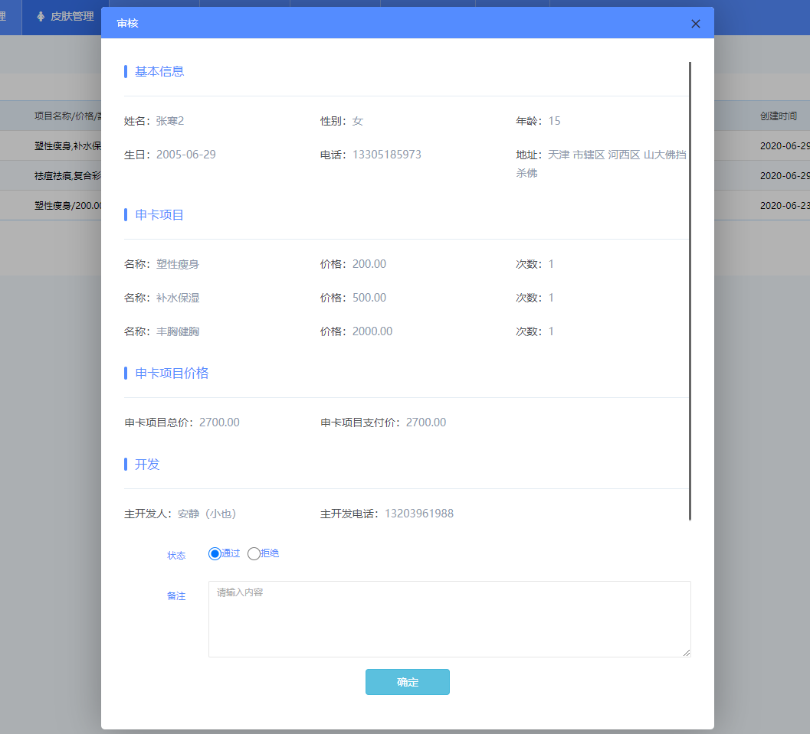

    - 请求方式：POST

    - 请求参数：

      | 参数   | 描述                      | 必填 |
      | ------ | ------------------------- | ---- |
      | status | 状态（1是同意  2.是拒绝） | 是   |
      | remark | 备注                      | 否   |
      | id     |                           | 是   |

    - 请求参数示例：

      ```javascript
      {
          status: 1
          remark: 测试
          id: 4
      }
      ```

      

    - 返回值

      ```javascript
      {"code":1,"msg":"操作成功","data":"","url":"","wait":3}
      ```

      

## 续卡审核

- 权限：超管

- 功能：

  - 审核
  - 

- 接口

  - 审核

    - 界面：

    - 请求方式：

    - 请求参数：

      | 参数 | 描述 | 必填 |
      | ---- | ---- | ---- |
      |      |      |      |

    - 请求参数示例：

      ```javascript
      
      ```

      

    - 返回值

# 到店管理

## 到店客户

- 权限：前台

- 功能：

  - 确认到店
  - 详情
  - 

- 接口

  - 确认到店

    - 界面：

    - 请求方式：

    - 请求参数：

      | 参数 | 描述 | 必填 |
      | ---- | ---- | ---- |
      |      |      |      |

    - 请求参数示例：

      ```javascript
      
      ```

      

    - 返回值

  - 详情

    - 界面：

    - 请求方式：

    - 请求参数：

      | 参数 | 描述 | 必填 |
      | ---- | ---- | ---- |
      |      |      |      |

    - 请求参数示例：

      ```javascript
      
      ```

      

    - 返回值

      

      ```php
      
      ```

      


# 分诊

## 待诊客户

- 描述：分配面诊医生

- 权限：护士站

- 功能：

  - 分诊
  - 详情
  - 

- 接口

  - 分诊

    - 界面：

    - 请求方式：

    - 请求参数：

      | 参数 | 描述 | 必填 |
      | ---- | ---- | ---- |
      |      |      |      |

    - 请求参数示例：

      ```javascript
      
      ```

      

    - 返回值

  - 详情

    - 界面：

    - 请求方式：

    - 请求参数：

      | 参数 | 描述 | 必填 |
      | ---- | ---- | ---- |
      |      |      |      |

    - 请求参数示例：

      ```javascript
      
      ```

      

    - 返回值

      

      ```php
      
      ```

      

# 面诊

## 客户列表

- 描述：确定所做项目

- 权限：面诊医生

- 功能：

  - 面诊确定项目
  - 详情
  - 打印项目单
  - 

- 接口

  - 面诊确定项目

    - 界面：

    - 请求方式：

    - 请求参数：

      | 参数 | 描述 | 必填 |
      | ---- | ---- | ---- |
      |      |      |      |

    - 请求参数示例：

      ```javascript
      
      ```

      

    - 返回值

  - 详情

    - 界面：

    - 请求方式：

    - 请求参数：

      | 参数 | 描述 | 必填 |
      | ---- | ---- | ---- |
      |      |      |      |

    - 请求参数示例：

      ```javascript
      
      ```

      

    - 返回值

      

      ```php
      
      ```

      

    


# 分配医护

## 客户列表

- 描述：分配医生和护士

- 权限：护士站

- 功能：

  - 分配
  - 详情
  - 

- 接口

  - 分配

    - 界面：

    - 请求方式：

    - 请求参数：

      | 参数 | 描述 | 必填 |
      | ---- | ---- | ---- |
      |      |      |      |

    - 请求参数示例：

      ```javascript
      
      ```

      

    - 返回值

  - 详情

    - 界面：

    - 请求方式：

    - 请求参数：

      | 参数 | 描述 | 必填 |
      | ---- | ---- | ---- |
      |      |      |      |

    - 请求参数示例：

      ```javascript
      
      ```

    - 返回值

      

      ```php
      
      ```

      

# 治疗

## 客户列表

- 描述：开始治疗

- 权限：陪同（销售）

- 功能：

  - 治疗
  - 详情
  - 

- 接口

  - 治疗

    - 界面：

    - 请求方式：

    - 请求参数：

      | 参数 | 描述 | 必填 |
      | ---- | ---- | ---- |
      |      |      |      |

    - 请求参数示例：

      ```javascript
      
      ```

      

    - 返回值

  - 详情

    - 界面：

    - 请求方式：

    - 请求参数：

      | 参数 | 描述 | 必填 |
      | ---- | ---- | ---- |
      |      |      |      |

    - 请求参数示例：

      ```javascript
      
      ```

      

    - 返回值

      ```php
      
      ```

      

# 离店

## 客户列表

- 描述：离店

- 权限：陪同（销售）

- 功能：

  - 离店
  - 详情
  - 

- 接口

  - 离店

    - 界面：

    - 请求方式：

    - 请求参数：

      | 参数 | 描述 | 必填 |
      | ---- | ---- | ---- |
      |      |      |      |

    - 请求参数示例：

      ```javascript
      
      ```

      

    - 返回值

  - 详情

    - 界面：

    - 请求方式：

    - 请求参数：

      | 参数 | 描述 | 必填 |
      | ---- | ---- | ---- |
      |      |      |      |

    - 请求参数示例：

      ```javascript
      
      ```

      

    - 返回值

      

      ```php
      
      ```

      


# 回访记录

## 回访列表

# 常见问题

```javascript
 卡的常见问题
 1. 顾客买卡项目未做完卡到期了怎么办？
 	答：给顾客续卡
 2. 顾客想做的项目自己的卡里没有或者卡项做完了怎么办？
	答：给顾客升卡
 3. 顾客第一次来没有卡怎么预约？
 	答：添加无卡预约，预约之后如果要做项目必须升卡（自定义卡，卡里的项目为预约要做的项目）
```


###### 在这填文档结束语