###### 河西美容医院系统文档<br><sup>皮肤管理</sup><br>──<br>**张寒**<br>*2020-06-29*

[TOC]

# 皮肤项目
## 项目列表

- 描述：这里是皮肤科所有的项目管理
- 权限：超管
- 功能：
  - 添加项目
  - 修改项目
  - 
- 接口：
  - 添加项目
  
    - 界面：
  
      
  
    - 请求方式：
  
    - 请求参数：
  
      | 参数 | 描述 | 必填 |
      | ---- | ---- | ---- |
      |      |      |      |
  
      
  
    - 请求参数示例：
  
      ```javascript
      
      ```
  
      
  
    - 返回值
  
  - 修改项目
  
    - 界面：
  
      
  
    - 请求方式：
  
    - 请求参数：
  
      | 参数 | 描述 | 必填 |
      | ---- | ---- | ---- |
      |      |      |      |
  
      
  
    - 请求参数示例：
  
      ```javascript
      
      ```
  
      
  
    - 返回值


##　皮肤床位

- 描述：这里是皮肤科床位管理（床位是用来管理客户来院数量的防止客户过多皮肤科消化不了）
- 权限：超管
- 功能：
  - 添加床位
  - 编辑床位
  - 
- 接口：
  - 添加床位
  
    - 界面：
  
      
  
    - 请求方式：
  
    - 请求参数：
  
      | 参数 | 描述 | 必填 |
      | ---- | ---- | ---- |
      |      |      |      |
  
      
  
    - 请求参数示例：
  
      ```javascript
      
      ```
  
      
  
    - 返回值
  
  - 编辑床位
  
    - 界面：
  
      
  
    - 请求方式：
  
    - 请求参数：
  
      | 参数 | 描述 | 必填 |
      | ---- | ---- | ---- |
      |      |      |      |
  
    - 请求参数示例：
  
      ```javascript
      
      ```
  
      
  
    - 返回值

# 人事管理

## 在职人员

# 年卡设置

## 年卡列表

- 描述： 皮肤科销售方式为打包捆绑式销售所以有了卡片.

- 权限：超管

- 功能：

  - 添加卡片
  - 编辑卡片
  - 

- 接口：

  - 添加卡片

    - 界面：

      

    - 请求方式：

    - 请求参数：

      | 参数 | 描述 | 必填 |
      | ---- | ---- | ---- |
      |      |      |      |

    - 请求参数示例：

      ```javascript
      
      ```

      

    - 返回值

  - 编辑卡片

    - 界面：

      

    - 请求方式：

    - 请求参数：

      | 参数 | 描述 | 必填 |
      | ---- | ---- | ---- |
      |      |      |      |

    - 请求参数示例：

      ```javascript
      
      ```

      

    - 返回值

# 客户管理

## 购卡客户

- 描述：此处可以看到所有的购卡客户

- 权限；前台/超管

- 功能

  - 购卡
  - 编辑
  - 升卡
  - 图片
  - 续卡
  - 划扣
  - 详情
  - 划扣详情
  - 设置标签
  - 管理员划扣
  - 

- 接口

  - 购卡：/pf/user/add.html

    - 界面：

      

    - 请求方式：POST

    - 请求参数：

      | 参数             | 描述     | 必填 |
      | ---------------- | -------- | ---- |
      | phone            | 手机     | 是   |
      | username         | 姓名     | 是   |
      | sex              | 性别     | 是   |
      | birthday         | 生日     | 是   |
      | age              | 年龄     | 是   |
      | main_reg_user_id | 主开发人 | 是   |
      | user_type        | 医院标签 | 否   |
      | province         | 省       | 是   |
      | city             | 市       | 否   |
      | area             | 区       | 否   |
      | address          | 具体地址 | 否   |
      | reg_user_id      | 开发     | 是   |
      | card_id          | 卡片     | 是   |
      | name             | 卡片名称 | 是   |
      | price            | 卡价格   | 是   |
      | validity         | 卡有效期 | 是   |
      | empty_card       |          | 是   |
      | comments         | 描述     | 否   |

    - 请求参数示例：

      ```javascript
      {
          phone: 13305185973
          username: 张寒
          sex: 1
          birthday: 1960-06-29
          age: 60
          main_reg_user_id: 10252
          user_type: 4
          province: 天津
          city: 市辖区
          area: 河西区
          address: 山大佛挡杀佛
          reg_user_id[]: 10120
          card_id: 5
          name: vip黄金卡
          price: 2700.00
          validity: 12
          empty_card: 0
          comments: 测试
      }
      ```

      

    - 返回值

  - 编辑：/pf/user/edit.html?id=6&empty_card=0

    - 界面：

      

    - 请求方式：POST

    - 请求参数：

      | 参数             | 描述     | 必填 |
      | ---------------- | -------- | ---- |
      | phone            | 手机     | 是   |
      | username         | 姓名     | 是   |
      | sex              | 性别     | 是   |
      | birthday         | 生日     | 是   |
      | age              | 年龄     | 是   |
      | main_reg_user_id | 主开发人 | 是   |
      | user_type        | 医院标签 | 否   |
      | province         | 省       | 是   |
      | city             | 市       | 否   |
      | area             | 区       | 否   |
      | address          | 具体地址 | 否   |
      | reg_user_id      | 开发     | 是   |
      | card_id          | 卡片     | 是   |
      | name             | 卡片名称 | 是   |
      | price            | 卡价格   | 是   |
      | validity         | 卡有效期 | 是   |
      | empty_card       |          | 是   |
      | comments         | 描述     | 否   |

    - 请求参数示例：

      ```javascript
      {
          phone: 13305185973
          username: 张寒2
          sex: 2
          birthday: 2005-06-29
          age: 15
          main_reg_user_id: 10252
          user_type: 4
          province: 天津
          city: 市辖区
          area: 河西区
          address: 山大佛挡杀佛
          begin_date: 0100-01-01
          validity_date: 0100-01-01
          reg_user_id[]: 10120
          card_id: 5
          id: 7
          comments: 第三饭
      }
      ```

      

    - 返回值

  - 升卡：/pf/user/upgrade.html?id=7

    - 界面：

      

    - 请求方式：

    - 请求参数：

      | 参数          | 描述     | 必填 |
      | ------------- | -------- | ---- |
      | uid           |          | 是   |
      | comments      | 描述     | 否   |
      | name          | 卡名     | 是   |
      | project_id    | 项目id   | 是   |
      | project_name  | 项目名称 | 是   |
      | num           |          |      |
      | project_num   | 项目数量 | 是   |
      | project_price | 项目价格 | 是   |
      | price         | 总价     | 是   |
      | validity      | 有效期   | 是   |
      | is_bosom      |          |      |

    - 请求参数示例：

      ```javascript
      {
          uid: 7
          comments: 测试
          name: 不记名卡
          project_id: 13,15,17,
          project_name: 塑性瘦身,补水保湿,丰胸健胸,
          num: 1,1,1,
          project_num: 1,1,1,
          project_price: 200.00,500.00,2000.00,
          price: 2700
          validity: 12
          is_bosom: 1,1,1,
      }
      ```

      

    - 返回值：

  - 图片：/pf/user/user_images.html?id=8

    - 描述：查看visa上传的照片

    - 界面：

    - 请求方式：

    - 请求参数：

      | 参数 | 描述 | 必填 |
      | ---- | ---- | ---- |
      |      |      |      |

    - 请求参数示例：

      ```javascript
      
      ```

      

    - 返回值

  - 续卡：/pf/user/continuation_card.html?id=8

    - 界面：

      

    - 请求方式：

    - 请求参数：

      | 参数          | 描述     | 必填 |
      | ------------- | -------- | ---- |
      | **pay_money** | 卡价格   | 是   |
      | comments      | 申请说明 | 否   |
      | uid           |          | 是   |
      | uc_id         |          | 是   |

    - 请求参数示例：

      ```javascript
      {
          pay_money: 2700.00
          comments: 测试续卡
          uid: 7
          uc_id: 9
      }
      ```

      

    - 返回值

      ```javascript
      {"code":1,"msg":"操作成功"}
      ```

      

  - 划扣：/pf/user/deduct.html?id=8

    - 界面：

      

    - 请求方式：

    - 请求参数：

      | 参数       | 描述   | 必填 |
      | ---------- | ------ | ---- |
      | order_id   | 订单   | 是   |
    | uc_id      |        | 是   |
      | project_id | 项目id | 是   |
    | num        | 数量id | 是   |
      | remark     | 备注   | 否   |
  
    - 请求参数示例：

      ```javascript
    {
          uc_id[]: 10
        uc_id[]: 10
          project_id[]: 18
        project_id[]: 19
          num[]: 1
        num[]: 1
          order_id: 5
        remark: 的深层次
      }
    ```
  
    
  
    - 返回值
  
- 详情：/pf/user/info.html?id=8
  
  - 界面：
  
      
  
  - 请求方式：
  
  - 请求参数：
  
    | 参数 | 描述 | 必填 |
      | ---- | ---- | ---- |
    |      |      |      |
  
    - 请求参数示例：
  
    ```javascript
      
    ```
  
    
  
  - 返回值
  
    
  
    ```php
      // info
    array(25) {
      ["id"] => string(1) "8"
        ["only_number"] => string(8) "20063001"
        ["username"] => string(6) "张寒"
      ["phone"] => string(11) "13309876545"
        ["reg_user_id"] => string(5) "10081"
      ["reg_user_name"] => string(6) "王博"
        ["reg_user_phone"] => string(11) "18322907067"
        ["age"] => string(2) "12"
        ["birthday"] => string(10) "2008-06-30"
      ["sex"] => string(1) "1"
        ["province"] => string(9) "内蒙古"
      ["city"] => string(9) "通辽市"
        ["area"] => string(9) "库伦旗"
      ["address"] => string(12) "的干活呢"
        ["create_time"] => string(10) "1593481311"
      ["user_type"] => string(1) "4"
        ["main_reg_user_id"] => string(5) "10044"
        ["main_reg_user_name"] => string(9) "王晨晨"
        ["main_reg_user_phone"] => string(11) "18855300488"
      ["status"] => string(1) "1"
        ["state"] => string(1) "1"
      ["ladybro_phone"] => string(1) "0"
        ["label"] => string(1) "S"
      ["empty_card"] => string(1) "1"
        ["create_user_id"] => string(5) "10270"
    }
      ```
    
      

  - 划扣详情：/pf/user/deduct_info.html?id=8

    - 界面：
  
      

    - 请求方式：

    - 请求参数：
  
      | 参数 | 描述 | 必填 |
    | ---- | ---- | ---- |
      | id   |      | 是   |

    - 返回值

      ```php
  // info
      array(26) {
      ["id"] => string(1) "8"
        ["only_number"] => string(8) "20063001"
    ["username"] => string(6) "张寒"
        ["phone"] => string(11) "13309876545"
      ["reg_user_id"] => string(5) "10081"
        ["reg_user_name"] => string(6) "王博"
      ["reg_user_phone"] => string(11) "18322907067"
        ["age"] => string(2) "12"
      ["birthday"] => string(10) "2008-06-30"
        ["sex"] => string(1) "1"
      ["province"] => string(9) "内蒙古"
        ["city"] => string(9) "通辽市"
      ["area"] => string(9) "库伦旗"
        ["address"] => string(12) "的干活呢"
      ["create_time"] => string(10) "1593481311"
        ["user_type"] => string(1) "4"
        ["main_reg_user_id"] => string(5) "10044"
        ["main_reg_user_name"] => string(9) "王晨晨"
      ["main_reg_user_phone"] => string(11) "18855300488"
        ["status"] => string(1) "1"
      ["state"] => string(1) "1"
        ["ladybro_phone"] => string(1) "0"
        ["label"] => string(1) "S"
        ["empty_card"] => string(1) "1"
      ["create_user_id"] => string(5) "10270"
        ["deduct"] => array(2) {
        [0] => array(11) {
            ["id"] => string(1) "6"
            ["uc_id"] => string(2) "10"
            ["project_id"] => string(2) "17"
            ["project_name"] => string(12) "丰胸健胸"
            ["project_price"] => string(7) "2000.00"
            ["num"] => string(1) "1"
            ["sys_uid"] => string(5) "10000"
            ["create_time"] => string(16) "2020-06-30 10:49"
            ["state"] => string(1) "1"
            ["uid"] => string(1) "8"
            ["oid"] => string(1) "5"
          }
          [1] => array(11) {
            ["id"] => string(1) "7"
            ["uc_id"] => string(2) "10"
            ["project_id"] => string(2) "18"
            ["project_name"] => string(12) "脱敏修复"
            ["project_price"] => string(7) "1200.00"
            ["num"] => string(1) "1"
            ["sys_uid"] => string(5) "10000"
            ["create_time"] => string(16) "2020-06-30 10:49"
            ["state"] => string(1) "1"
            ["uid"] => string(1) "8"
            ["oid"] => string(1) "5"
          }
        }
      }
      ```
      
      
  
  - 设置标签：/pf/user/set_label.html?id=8
  
    - 界面：
  
      
  
    - 请求方式：POST
  
    - 请求参数：
  
      | 参数  | 描述 | 必填 |
      | ----- | ---- | ---- |
      | title | 标签 | 是   |
      | id    |      | 是   |
  
    - 请求参数示例：
  
      ```javascript
      {
          title: S
          id: 8
      }
      ```
  
      
  
    - 返回值
  
  - 管理员划扣
  
    - 界面：/pf/user/deduct.html
  
      
  
       
  
      
  
       
  
      
  
    - 请求方式：POST
  
    - 请求参数：
  
      | 参数         | 描述 | 必填 |
      | ------------ | ---- | ---- |
      | uc_id        |      |      |
    | project_id   |      |      |
      | num          |      |      |
    | order_id     |      |      |
      | remark       |      |      |
      | admin_remark |      |      |
      | is_admin     |      |      |
  
    - 请求参数示例：
  
      ```javascript
      {
          uc_id[]: 10
          uc_id[]: 10
          project_id[]: 14
          project_id[]: 16
          num[]: 1
          num[]: 1
          order_id: 4
          remark: 哈哈哈
          admin_remark: 法国和规范
          is_admin: 1
      }
      ```
    
      
    
    - 返回值

## 客户订单

- 权限：前台/超管

- 功能:

  - 查看详情
  - 取消订单
  - 

- 接口

  - 查看详情

    - 界面：

      

    - 请求方式：

    - 请求参数：

      | 参数 | 描述 | 必填 |
      | ---- | ---- | ---- |
      |      |      |      |

    - 请求参数示例：

      ```javascript
      
      ```

      

    - 返回值

      

      ```php
      
      ```

      

  - 取消订单

    - 界面：

      

    - 请求方式：

    - 请求参数：

      | 参数 | 描述 | 必填 |
      | ---- | ---- | ---- |
      |      |      |      |

    - 请求参数示例：

      ```javascript
      
      ```

      

    - 返回值


# 卡项审核

## 购卡审核

- 权限：超管

- 功能：

  - 审核
  - 

- 接口

  - 审核：/pf/audit/add.html?id=8

    - 界面：

      

    - 请求方式：POST

    - 请求参数：

      | 参数  | 描述                     | 必填 |
      | ----- | ------------------------ | ---- |
      | state | 状态（1是同意  2是拒绝） | 是   |
      | id    |                          |      |

    - 请求参数示例：

      ```javascript
      {
          state: 1
      	id: 8
      }
      ```

      

    - 返回值

## 升卡审核

- 权限：超管

- 功能：

  - 审核
  - 

- 接口

  - 审核：/pf/audit/check.html?id=3

    - 界面：

      

    - 请求方式：POST

    - 请求参数：

      | 参数   | 描述                      | 必填 |
      | ------ | ------------------------- | ---- |
      | status | 状态（1是同意  2.是拒绝） | 是   |
      | remark | 备注                      | 否   |
      | id     |                           | 是   |

    - 请求参数示例：

      ```javascript
      {
          status: 1
          remark: 测试
          id: 4
      }
      ```

      

    - 返回值

      ```javascript
      {"code":1,"msg":"操作成功","data":"","url":"","wait":3}
      ```

      

## 续卡审核

- 权限：超管

- 功能：

  - 审核
  - 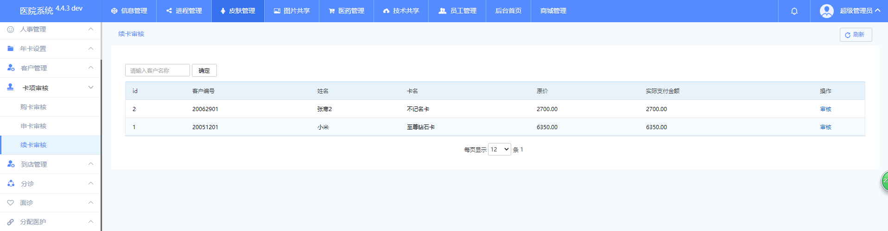

- 接口

  - 审核：/pf/audit/xu_check.html?id=2

    - 界面：

      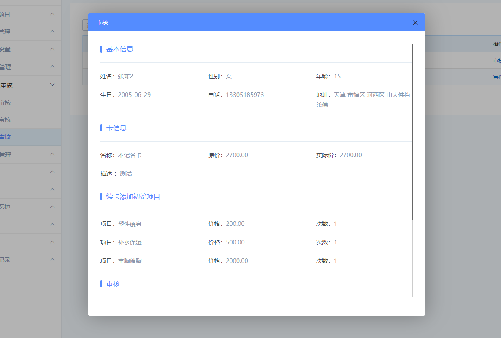

    - 请求方式：POST

    - 请求参数：
    
      | 参数   | 描述                      | 必填 |
  | ------ | ------------------------- | ---- |
      | status | 状态（1是通过   2是拒绝） | 是   |
  | remark | 备注                      | 是   |
      | id     |                           | 是   |
    
    - 请求参数示例：

      ```javascript
  {
          status: 1
          remark: 地方高富帅的
          id: 1
      }
      ```
    
      
    
    - 返回值
    
      ```javascript
      {"code":1,"msg":"操作成功","data":"","url":"","wait":3}
      ```
    
      

# 到店管理

## 到店客户

- 权限：前台

- 功能：

  - 确认到店
  - 详情
  - 

- 接口

  - 确认到店

    - 界面：

      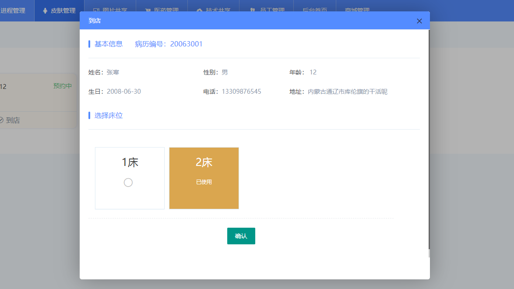

    - 请求方式：POST

    - 请求参数：
  
      | 参数   | 描述 | 必填 |
    | ------ | ---- | ---- |
      | id     |      | 是   |
    | bed_id | 床位 | 是   |
  
    - 请求参数示例：
  
    ```javascript
      {
        bed_id: 1
      	id: 4
    }
      ```

      

    - 返回值

  - 详情

    - 界面：
  
    - 请求方式：

    - 请求参数：

      | 参数 | 描述 | 必填 |
      | ---- | ---- | ---- |
      |      |      |      |

    - 请求参数示例：

      ```javascript
    
      ```

      
  
    - 返回值

      ```php
  
      ```
      
      
  
      
      
      ```php
      
      ```
      
      


# 分诊

## 待诊客户

- 描述：分配面诊医生

- 权限：护士站

- 功能：

  - 分诊
  - 详情
  - 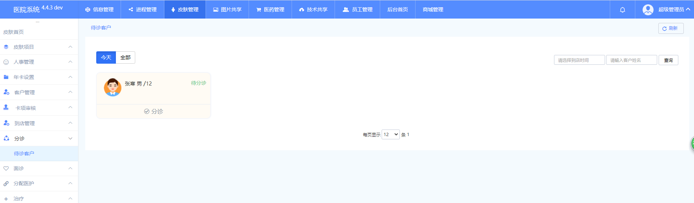

- 接口

  - 分诊：/pf/allocation/add.html

    - 界面：

      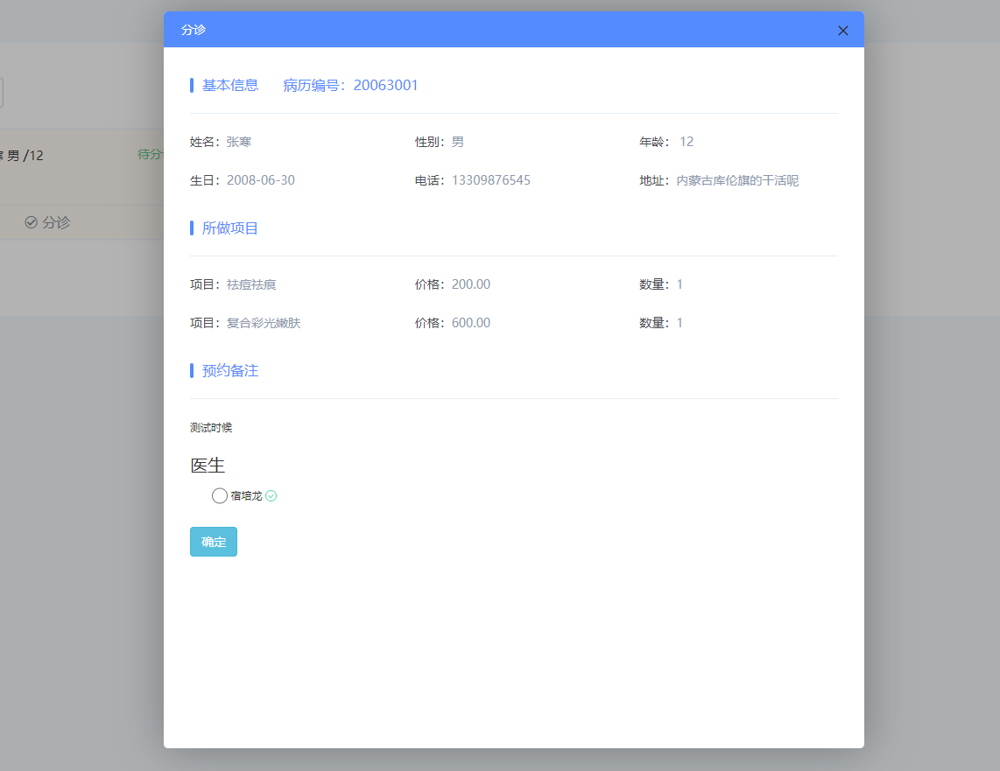

    - 请求方式：POST

    - 请求参数：
  
      | 参数 | 描述 | 必填 |
    | ---- | ---- | ---- |
      |      |      |      |

    - 请求参数示例：
  
      ```javascript
    
      ```

      

    - 返回值

  - 详情

    - 界面：

      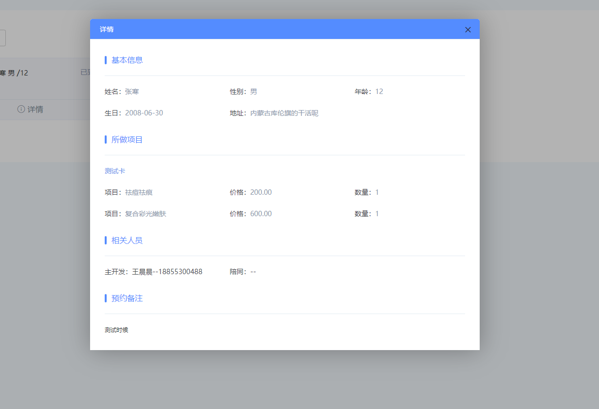

    - 请求方式：GET
  
    - 请求参数：
  
      | 参数          | 描述     | 必填 |
  | ------------- | -------- | ---- |
      | id            |          | 是   |
    | **doctor_id** | 面诊医生 | 是   |
    
  - 请求参数示例：
    
  ```javascript
      {
      id: 4
          doctor_id: 10089
  }
      ```
  
      
  
    - 返回值
  
      
    
      ```php
      // info
      array(31) {
      ["id"] => string(1) "4"
        ["uid"] => string(1) "8"
        ["main_show_user"] => string(1) "0"
        ["reg_user_id"] => string(5) "10081"
        ["main_reg_user_id"] => string(5) "10044"
        ["create_time"] => string(10) "1593481546"
        ["subscribe_time"] => string(10) "1593481500"
        ["remark"] => string(12) "测试时候"
        ["status"] => string(1) "1"
        ["sys_status"] => string(1) "1"
        ["exploit_num"] => string(11) "13218025789"
        ["source"] => string(6) "美团"
        ["user_card_id"] => string(1) "0"
        ["project_info"] => string(245) "[{"uc_id":"10","project_list":[{"project_id":"14","project_price":"200.00","project_num":"1","project_name":"祛痘祛痕","num":"1"},{"project_id":"16","project_price":"600.00","project_num":"1","project_name":"复合彩光嫩肤","num":"1"}]}]"
        ["user"] => array(25) {
          ["id"] => string(1) "8"
          ["only_number"] => string(8) "20063001"
          ["username"] => string(6) "张寒"
          ["phone"] => string(11) "13309876545"
          ["reg_user_id"] => string(5) "10081"
          ["reg_user_name"] => string(6) "王博"
          ["reg_user_phone"] => string(11) "18322907067"
          ["age"] => string(2) "12"
          ["birthday"] => string(10) "2008-06-30"
          ["sex"] => string(1) "1"
          ["province"] => string(9) "内蒙古"
          ["city"] => string(9) "通辽市"
          ["area"] => string(9) "库伦旗"
          ["address"] => string(12) "的干活呢"
          ["create_time"] => string(10) "1593481311"
          ["user_type"] => string(1) "4"
          ["main_reg_user_id"] => string(5) "10044"
          ["main_reg_user_name"] => string(9) "王晨晨"
          ["main_reg_user_phone"] => string(11) "18855300488"
          ["status"] => string(1) "1"
          ["state"] => string(1) "1"
          ["ladybro_phone"] => string(1) "0"
          ["label"] => string(0) ""
          ["empty_card"] => string(1) "1"
          ["create_user_id"] => string(5) "10270"
        }
        ["info"] => array(2) {
          [0] => array(11) {
            ["id"] => string(2) "21"
            ["order_id"] => string(1) "4"
            ["uc_id"] => string(2) "10"
            ["project_id"] => string(2) "14"
            ["project_name"] => string(12) "祛痘祛痕"
            ["project_num"] => string(1) "1"
            ["project_price"] => string(6) "200.00"
            ["num"] => string(1) "1"
            ["status"] => string(1) "1"
            ["type"] => string(1) "1"
            ["true_num"] => string(1) "0"
          }
          [1] => array(11) {
            ["id"] => string(2) "22"
            ["order_id"] => string(1) "4"
            ["uc_id"] => string(2) "10"
            ["project_id"] => string(2) "16"
            ["project_name"] => string(18) "复合彩光嫩肤"
            ["project_num"] => string(1) "1"
            ["project_price"] => string(6) "600.00"
            ["num"] => string(1) "1"
            ["status"] => string(1) "1"
            ["type"] => string(1) "1"
            ["true_num"] => string(1) "0"
          }
        }
      }
      ```
      
      

# 面诊

## 客户列表

- 描述：确定所做项目（忽悠客户尽可能多做项目）确定之后打印项目单到前台签字盖章并且划扣

- 权限：面诊医生

- 功能：

  - 接诊
  - 详情
  - 打印项目单
  - 

- 接口

  - 接诊

    - 描述：确定顾客做项目（忽悠客户尽可能多做项目）

    - 界面：

      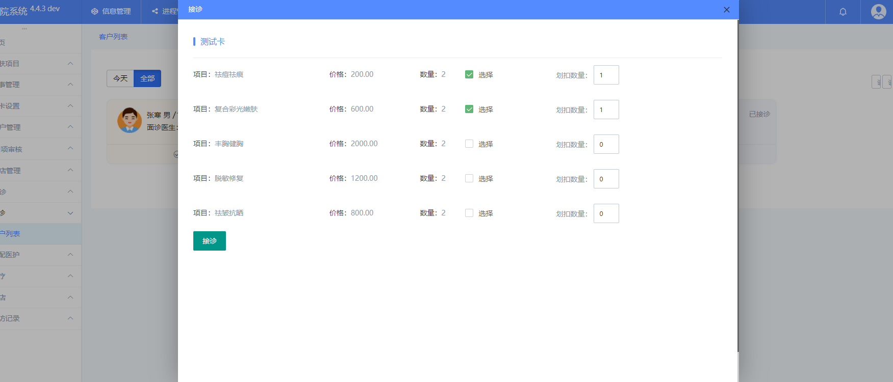

    - 请求方式：POST
  
    - 请求参数：

      | 参数 | 描述 | 必填 |
    | ---- | ---- | ---- |
      |      |      |      |
      |      |      |      |
  
  - 请求参数示例：
  
    ```javascript
      {
    
      }
    ```
  
    
  
  - 返回值
  
- 详情：/pf/cure/info.html?id=4
  
    - 界面：
  
    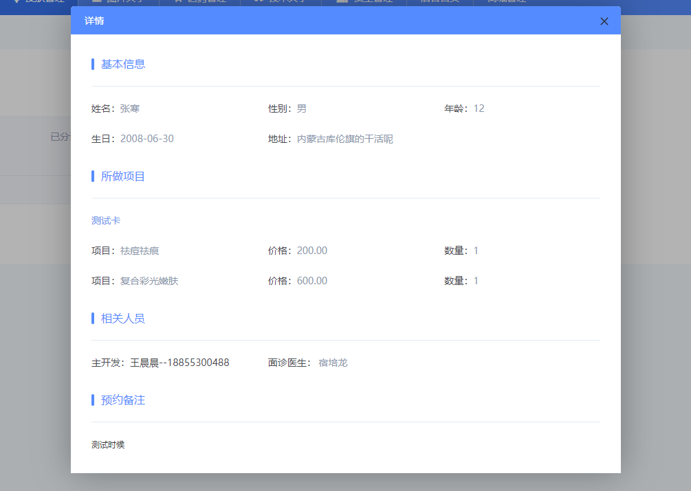
  
  - 请求方式：GET
  
    - 请求参数：
    
    | 参数 | 描述 | 必填 |
    | ---- | ---- | ---- |
    | id   |      | 是   |
  
  - 请求参数示例：
    
    ```javascript
    
      ```
  
    
  
  - 返回值
  
      ```php
    // info
      array(19) {
      ["id"] => string(1) "3"
        ["order_num"] => string(13) "2020062350256"
    ["uid"] => string(1) "6"
        ["create_user"] => string(5) "10193"
        ["create_users"] => string(5) "10119"
        ["escort"] => string(1) "0"
        ["escorts"] => string(0) ""
        ["create_time"] => string(10) "1592904317"
        ["status"] => string(1) "7"
        ["sys_uid"] => string(5) "10000"
        ["s_id"] => string(1) "3"
        ["bed_id"] => string(1) "1"
        ["remark"] => string(0) ""
        ["subscribe_remark"] => string(0) ""
        ["admin_remark"] => string(0) ""
        ["user"] => array(25) {
          ["id"] => string(1) "6"
          ["only_number"] => string(8) "20062302"
          ["username"] => string(3) "浪"
          ["phone"] => string(11) "15764316461"
          ["reg_user_id"] => string(5) "10119"
          ["reg_user_name"] => string(21) "梅子（何冬梅）"
          ["reg_user_phone"] => string(11) "15094374871"
          ["age"] => string(2) "15"
          ["birthday"] => string(10) "2005-06-23"
          ["sex"] => string(1) "1"
          ["province"] => string(6) "山西"
          ["city"] => string(9) "长治市"
          ["area"] => string(9) "襄垣县"
          ["address"] => string(0) ""
          ["create_time"] => string(10) "1592902738"
          ["user_type"] => string(1) "3"
          ["main_reg_user_id"] => string(5) "10193"
          ["main_reg_user_name"] => string(9) "何祥瑞"
          ["main_reg_user_phone"] => string(11) "18061273443"
          ["status"] => string(1) "1"
          ["state"] => string(1) "1"
          ["ladybro_phone"] => string(1) "0"
          ["label"] => string(0) ""
          ["empty_card"] => string(1) "0"
          ["create_user_id"] => string(5) "10193"
        }
        ["cure_time"] => string(16) "2020-06-23 17:25"
        ["info"] => array(5) {
          [0] => array(11) {
            ["id"] => string(2) "16"
            ["order_id"] => string(1) "3"
            ["uc_id"] => string(1) "7"
            ["project_id"] => string(2) "13"
            ["project_name"] => string(12) "塑性瘦身"
            ["project_num"] => string(1) "1"
            ["project_price"] => string(6) "200.00"
            ["num"] => string(1) "1"
            ["status"] => string(1) "1"
            ["type"] => string(1) "1"
            ["true_num"] => string(1) "0"
          }
          [1] => array(11) {
            ["id"] => string(2) "17"
            ["order_id"] => string(1) "3"
            ["uc_id"] => string(1) "7"
            ["project_id"] => string(2) "14"
            ["project_name"] => string(12) "祛痘祛痕"
            ["project_num"] => string(1) "1"
            ["project_price"] => string(6) "200.00"
            ["num"] => string(1) "1"
            ["status"] => string(1) "1"
            ["type"] => string(1) "1"
            ["true_num"] => string(1) "0"
          }
        }
        ["counselor_name"] => string(9) "宿培龙"
      }
      ```
      
      
    
    


# 分配医护

## 客户列表

- 描述：分配医生和护士

- 权限：护士站

- 功能：

  - 分配
  - 详情
  - 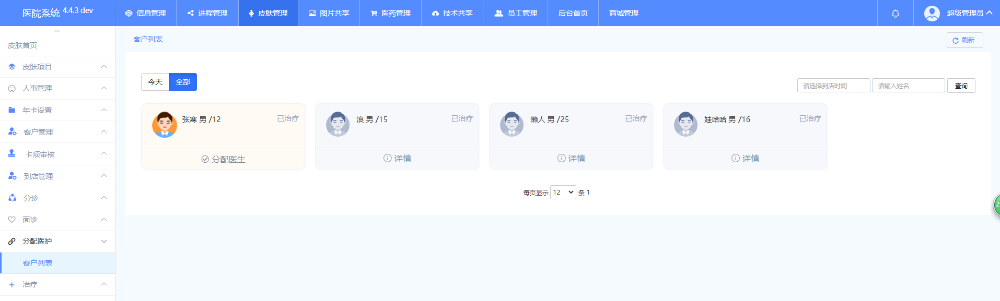

- 接口

  - 分配：/pf/mate/add.html?id=4

    - 界面：

      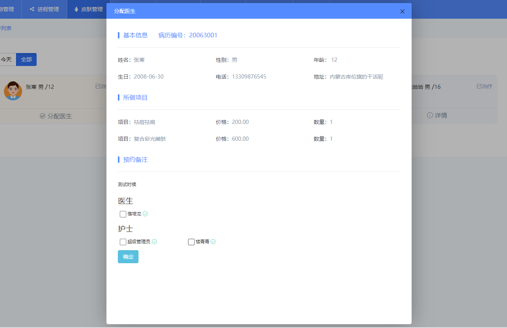

    - 请求方式：POST

    - 请求参数：
  
      | 参数      | 描述 | 必填 |
    | --------- | ---- | ---- |
      | id        |      | 是   |
    | doctor_id | 医生 | 否   |
      | nurse_id  | 护士 | 是   |
  
    - 请求参数示例：

      ```javascript
    {
          id: 4
        doctor_id[]: 10089
          nurse_id[]: 10000
    }
      ```

      

    - 返回值

  - 详情：/pf/mate/info.html?id=3
  
    - 界面：

      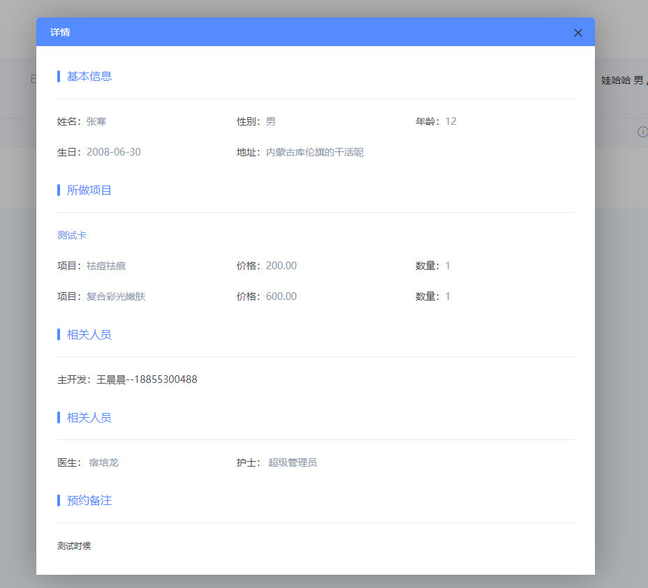

    - 请求方式：GET
  
    - 请求参数：
  
      | 参数 | 描述 | 必填 |
  | ---- | ---- | ---- |
      | id   |      | 是   |

    - 请求参数示例：
    
      ```javascript
  
      ```
  
    - 返回值
  
      ```php
    // info
      array(19) {
      ["id"] => string(1) "4"
        ["order_num"] => string(13) "2020063081799"
      ["uid"] => string(1) "8"
        ["create_user"] => string(5) "10044"
        ["create_users"] => string(5) "10081"
        ["escort"] => string(1) "0"
        ["escorts"] => string(0) ""
        ["create_time"] => string(10) "1593481738"
        ["status"] => string(1) "5"
        ["sys_uid"] => string(5) "10000"
        ["s_id"] => string(1) "4"
        ["bed_id"] => string(1) "1"
        ["remark"] => string(0) ""
        ["subscribe_remark"] => string(12) "测试时候"
        ["admin_remark"] => string(0) ""
        ["user"] => array(25) {
          ["id"] => string(1) "8"
          ["only_number"] => string(8) "20063001"
          ["username"] => string(6) "张寒"
          ["phone"] => string(11) "13309876545"
          ["reg_user_id"] => string(5) "10081"
          ["reg_user_name"] => string(6) "王博"
          ["reg_user_phone"] => string(11) "18322907067"
          ["age"] => string(2) "12"
          ["birthday"] => string(10) "2008-06-30"
          ["sex"] => string(1) "1"
          ["province"] => string(9) "内蒙古"
          ["city"] => string(9) "通辽市"
          ["area"] => string(9) "库伦旗"
          ["address"] => string(12) "的干活呢"
          ["create_time"] => string(10) "1593481311"
          ["user_type"] => string(1) "4"
          ["main_reg_user_id"] => string(5) "10044"
          ["main_reg_user_name"] => string(9) "王晨晨"
          ["main_reg_user_phone"] => string(11) "18855300488"
          ["status"] => string(1) "1"
          ["state"] => string(1) "1"
          ["ladybro_phone"] => string(1) "0"
          ["label"] => string(0) ""
          ["empty_card"] => string(1) "1"
          ["create_user_id"] => string(5) "10270"
        }
        ["info"] => array(2) {
          [0] => array(11) {
            ["id"] => string(2) "23"
            ["order_id"] => string(1) "4"
            ["uc_id"] => string(2) "10"
            ["project_id"] => string(2) "14"
            ["project_name"] => string(12) "祛痘祛痕"
            ["project_num"] => string(1) "1"
            ["project_price"] => string(6) "200.00"
            ["num"] => string(1) "1"
            ["status"] => string(1) "1"
            ["type"] => string(1) "1"
            ["true_num"] => string(1) "0"
          }
          [1] => array(11) {
            ["id"] => string(2) "24"
            ["order_id"] => string(1) "4"
            ["uc_id"] => string(2) "10"
            ["project_id"] => string(2) "16"
            ["project_name"] => string(18) "复合彩光嫩肤"
            ["project_num"] => string(1) "1"
            ["project_price"] => string(6) "600.00"
            ["num"] => string(1) "1"
            ["status"] => string(1) "1"
            ["type"] => string(1) "1"
            ["true_num"] => string(1) "0"
          }
        }
        ["allocation"] => array(4) {
          ["doctor_id"] => string(5) "10089"
          ["nurse_id"] => string(5) "10000"
          ["doctor_name"] => array(1) {
            [0] => string(9) "宿培龙"
          }
          ["nurse_name"] => array(1) {
            [0] => string(15) "超级管理员"
          }
        }
        ["counselor_name"] => string(9) "宿培龙"
      }
      ```
      
      

# 治疗

## 客户列表

- 描述：开始治疗

- 权限：陪同（销售）

- 功能：

  - 结束治疗
  - 详情
  - 

- 接口

  - 结束治疗： /pf/treat/add.html?id=4

    - 界面：

      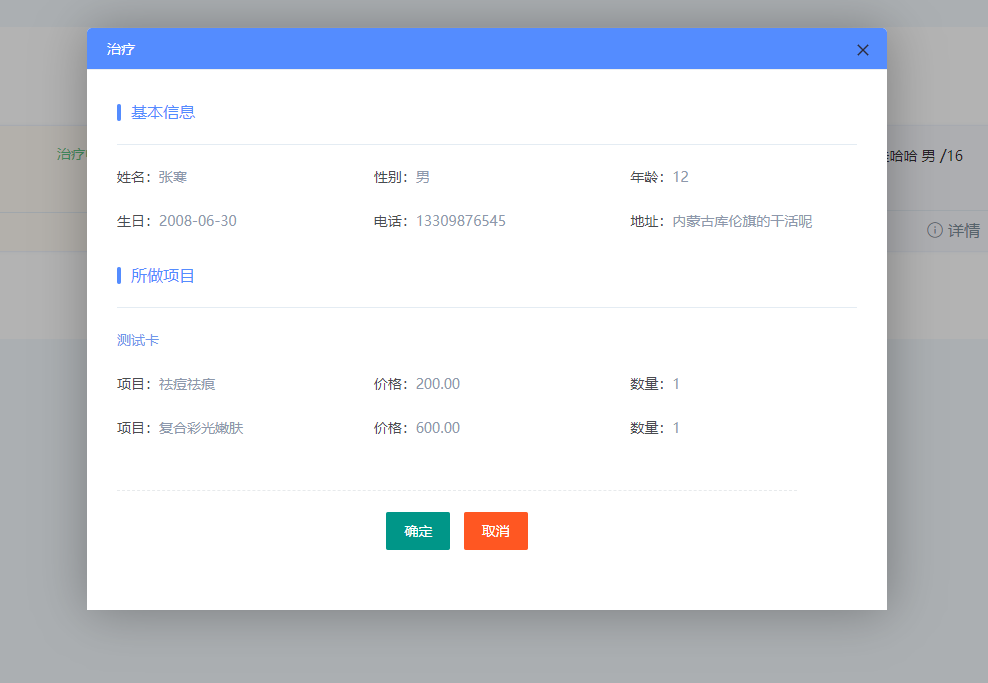

    - 请求方式：POST

    - 请求参数：
  
      | 参数 | 描述 | 必填 |
    | ---- | ---- | ---- |
      | id   |      | 是   |

    - 请求参数示例：
  
      ```javascript
    
      ```

      

    - 返回值

  - 详情：/pf/treat/info.html?id=3

    - 界面：

    - 请求方式：

    - 请求参数：
  
      | 参数 | 描述 | 必填 |
    | ---- | ---- | ---- |
      | id   |      | 是   |

    - 请求参数示例：
  
      ```javascript
    
      ```

      

    - 返回值
  
      ```php
     // info
      array(19) {
    ["id"] => string(1) "3"
        ["order_num"] => string(13) "2020062350256"
        ["uid"] => string(1) "6"
        ["create_user"] => string(5) "10193"
        ["create_users"] => string(5) "10119"
        ["escort"] => string(1) "0"
        ["escorts"] => string(0) ""
        ["create_time"] => string(10) "1592904317"
        ["status"] => string(1) "7"
        ["sys_uid"] => string(5) "10000"
        ["s_id"] => string(1) "3"
        ["bed_id"] => string(1) "1"
        ["remark"] => string(0) ""
        ["subscribe_remark"] => string(0) ""
        ["admin_remark"] => string(0) ""
        ["user"] => array(25) {
          ["id"] => string(1) "6"
          ["only_number"] => string(8) "20062302"
          ["username"] => string(3) "浪"
          ["phone"] => string(11) "15764316461"
          ["reg_user_id"] => string(5) "10119"
          ["reg_user_name"] => string(21) "梅子（何冬梅）"
          ["reg_user_phone"] => string(11) "15094374871"
          ["age"] => string(2) "15"
          ["birthday"] => string(10) "2005-06-23"
          ["sex"] => string(1) "1"
          ["province"] => string(6) "山西"
          ["city"] => string(9) "长治市"
          ["area"] => string(9) "襄垣县"
          ["address"] => string(0) ""
          ["create_time"] => string(10) "1592902738"
          ["user_type"] => string(1) "3"
          ["main_reg_user_id"] => string(5) "10193"
          ["main_reg_user_name"] => string(9) "何祥瑞"
          ["main_reg_user_phone"] => string(11) "18061273443"
          ["status"] => string(1) "1"
          ["state"] => string(1) "1"
          ["ladybro_phone"] => string(1) "0"
          ["label"] => string(0) ""
          ["empty_card"] => string(1) "0"
          ["create_user_id"] => string(5) "10193"
        }
        ["counselor_name"] => string(9) "宿培龙"
        ["info"] => array(5) {
          [0] => array(11) {
            ["id"] => string(2) "16"
            ["order_id"] => string(1) "3"
            ["uc_id"] => string(1) "7"
            ["project_id"] => string(2) "13"
            ["project_name"] => string(12) "塑性瘦身"
            ["project_num"] => string(1) "1"
            ["project_price"] => string(6) "200.00"
            ["num"] => string(1) "1"
            ["status"] => string(1) "1"
            ["type"] => string(1) "1"
            ["true_num"] => string(1) "0"
          }
          [1] => array(11) {
            ["id"] => string(2) "17"
            ["order_id"] => string(1) "3"
            ["uc_id"] => string(1) "7"
            ["project_id"] => string(2) "14"
            ["project_name"] => string(12) "祛痘祛痕"
            ["project_num"] => string(1) "1"
            ["project_price"] => string(6) "200.00"
            ["num"] => string(1) "1"
            ["status"] => string(1) "1"
            ["type"] => string(1) "1"
            ["true_num"] => string(1) "0"
          }
          [2] => array(11) {
            ["id"] => string(2) "18"
            ["order_id"] => string(1) "3"
            ["uc_id"] => string(1) "7"
            ["project_id"] => string(2) "15"
            ["project_name"] => string(12) "补水保湿"
            ["project_num"] => string(1) "1"
            ["project_price"] => string(6) "500.00"
            ["num"] => string(1) "1"
            ["status"] => string(1) "1"
            ["type"] => string(1) "1"
            ["true_num"] => string(1) "0"
          }
          [3] => array(11) {
            ["id"] => string(2) "19"
            ["order_id"] => string(1) "3"
            ["uc_id"] => string(1) "7"
            ["project_id"] => string(2) "16"
            ["project_name"] => string(18) "复合彩光嫩肤"
            ["project_num"] => string(1) "1"
            ["project_price"] => string(6) "600.00"
            ["num"] => string(1) "1"
            ["status"] => string(1) "1"
            ["type"] => string(1) "1"
            ["true_num"] => string(1) "0"
          }
          [4] => array(11) {
            ["id"] => string(2) "20"
            ["order_id"] => string(1) "3"
            ["uc_id"] => string(1) "7"
            ["project_id"] => string(2) "17"
            ["project_name"] => string(12) "丰胸健胸"
            ["project_num"] => string(1) "1"
            ["project_price"] => string(7) "2000.00"
            ["num"] => string(1) "1"
            ["status"] => string(1) "1"
            ["type"] => string(1) "1"
            ["true_num"] => string(1) "0"
          }
        }
        ["allocation"] => array(4) {
          ["doctor_id"] => string(5) "10089"
          ["nurse_id"] => string(5) "10168"
          ["doctor_name"] => array(1) {
            [0] => string(9) "宿培龙"
          }
          ["nurse_name"] => array(1) {
            [0] => string(9) "楼青青"
          }
        }
      }
      ```
      
      

# 离店

## 客户列表

- 描述：离店

- 权限：陪同（销售）

- 功能：

  - 离店
  - 详情
  - 

- 接口

  - 离店：/pf/leave/add.html?id=4

    - 界面：

      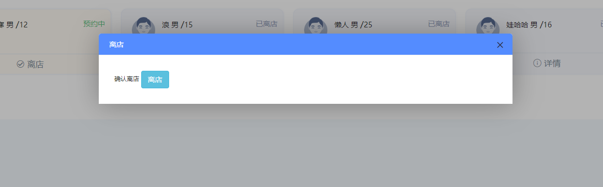

    - 请求方式：POST

    - 请求参数：
  
      | 参数 | 描述 | 必填 |
    | ---- | ---- | ---- |
      | id   |      | 是   |

    - 返回值
  
  - 详情：/pf/leave/info.html?id=4

    - 界面：

      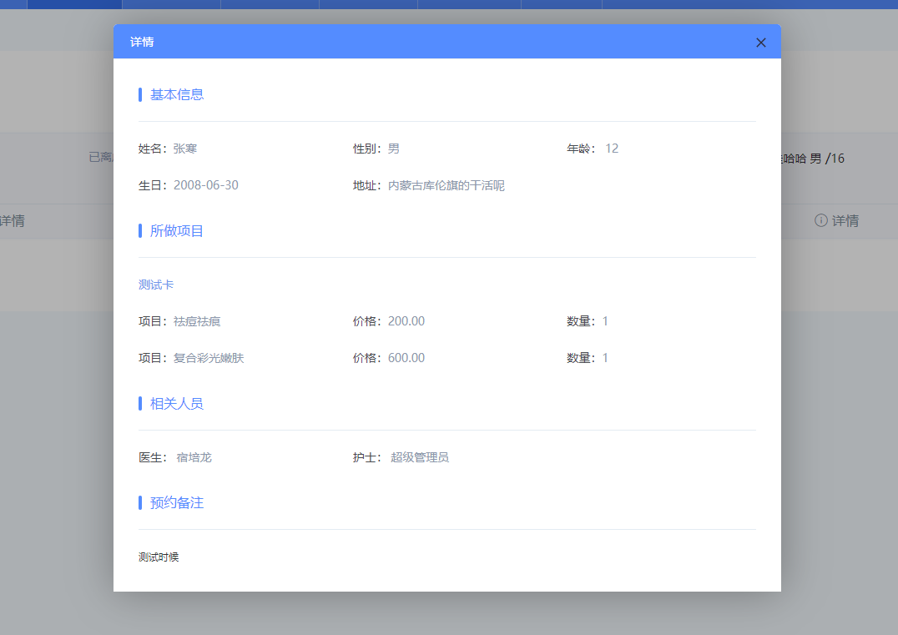

    - 请求方式：GET

    - 请求参数：
  
      | 参数 | 描述 | 必填 |
  | ---- | ---- | ---- |
      | id   |      | 是   |

    - 返回值
    
      

      ```php
  // info
      array(19) {
    ["id"] => string(1) "4"
        ["order_num"] => string(13) "2020063081799"
    ["uid"] => string(1) "8"
        ["create_user"] => string(5) "10044"
      ["create_users"] => string(5) "10081"
        ["escort"] => string(1) "0"
    ["escorts"] => string(0) ""
        ["create_time"] => string(10) "1593481738"
      ["status"] => string(1) "7"
        ["sys_uid"] => string(5) "10000"
        ["s_id"] => string(1) "4"
        ["bed_id"] => string(1) "1"
      ["remark"] => string(0) ""
        ["subscribe_remark"] => string(12) "测试时候"
        ["admin_remark"] => string(0) ""
        ["counselor_name"] => string(9) "宿培龙"
        ["user"] => array(25) {
          ["id"] => string(1) "8"
          ["only_number"] => string(8) "20063001"
          ["username"] => string(6) "张寒"
          ["phone"] => string(11) "13309876545"
          ["reg_user_id"] => string(5) "10081"
          ["reg_user_name"] => string(6) "王博"
          ["reg_user_phone"] => string(11) "18322907067"
          ["age"] => string(2) "12"
          ["birthday"] => string(10) "2008-06-30"
          ["sex"] => string(1) "1"
          ["province"] => string(9) "内蒙古"
          ["city"] => string(9) "通辽市"
          ["area"] => string(9) "库伦旗"
          ["address"] => string(12) "的干活呢"
          ["create_time"] => string(10) "1593481311"
          ["user_type"] => string(1) "4"
          ["main_reg_user_id"] => string(5) "10044"
          ["main_reg_user_name"] => string(9) "王晨晨"
          ["main_reg_user_phone"] => string(11) "18855300488"
          ["status"] => string(1) "1"
          ["state"] => string(1) "1"
          ["ladybro_phone"] => string(1) "0"
          ["label"] => string(0) ""
          ["empty_card"] => string(1) "1"
          ["create_user_id"] => string(5) "10270"
        }
        ["info"] => array(2) {
          [0] => array(11) {
            ["id"] => string(2) "23"
            ["order_id"] => string(1) "4"
            ["uc_id"] => string(2) "10"
            ["project_id"] => string(2) "14"
            ["project_name"] => string(12) "祛痘祛痕"
            ["project_num"] => string(1) "1"
            ["project_price"] => string(6) "200.00"
            ["num"] => string(1) "1"
            ["status"] => string(1) "1"
            ["type"] => string(1) "1"
            ["true_num"] => string(1) "0"
          }
          [1] => array(11) {
            ["id"] => string(2) "24"
            ["order_id"] => string(1) "4"
            ["uc_id"] => string(2) "10"
            ["project_id"] => string(2) "16"
            ["project_name"] => string(18) "复合彩光嫩肤"
            ["project_num"] => string(1) "1"
            ["project_price"] => string(6) "600.00"
            ["num"] => string(1) "1"
            ["status"] => string(1) "1"
            ["type"] => string(1) "1"
            ["true_num"] => string(1) "0"
          }
        }
        ["allocation"] => array(4) {
          ["doctor_id"] => string(5) "10089"
          ["nurse_id"] => string(5) "10000"
          ["doctor_name"] => array(1) {
            [0] => string(9) "宿培龙"
          }
          ["nurse_name"] => array(1) {
            [0] => string(15) "超级管理员"
          }
        }
      }
      ```
      
      


# 回访记录

## 回访列表

# 常见问题

```javascript
 卡的常见问题
 1. 顾客买卡项目未做完卡到期了怎么办？
 	答：给顾客续卡
 2. 顾客想做的项目自己的卡里没有或者卡项做完了怎么办？
	答：给顾客升卡
 3. 顾客第一次来没有卡怎么预约？
 	答：添加无卡预约，预约之后如果要做项目必须升卡（自定义卡，卡里的项目为预约要做的项目）
```


###### 在这填文档结束语