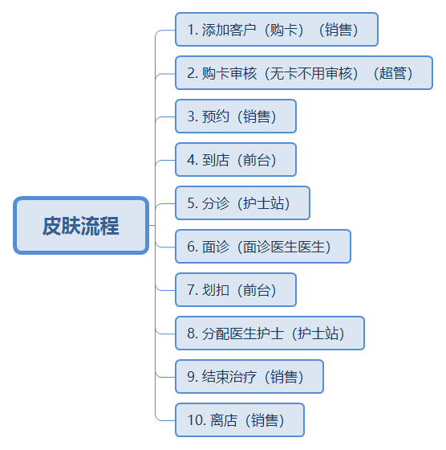
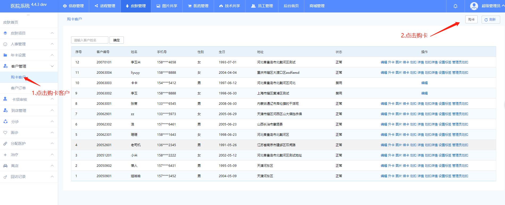
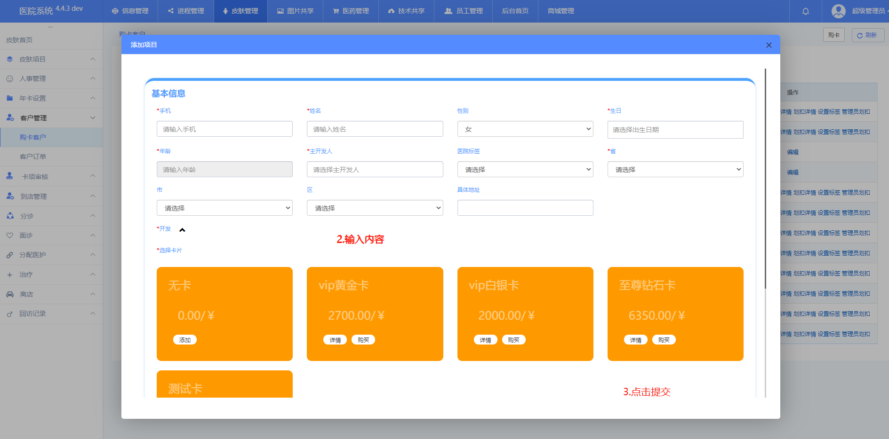
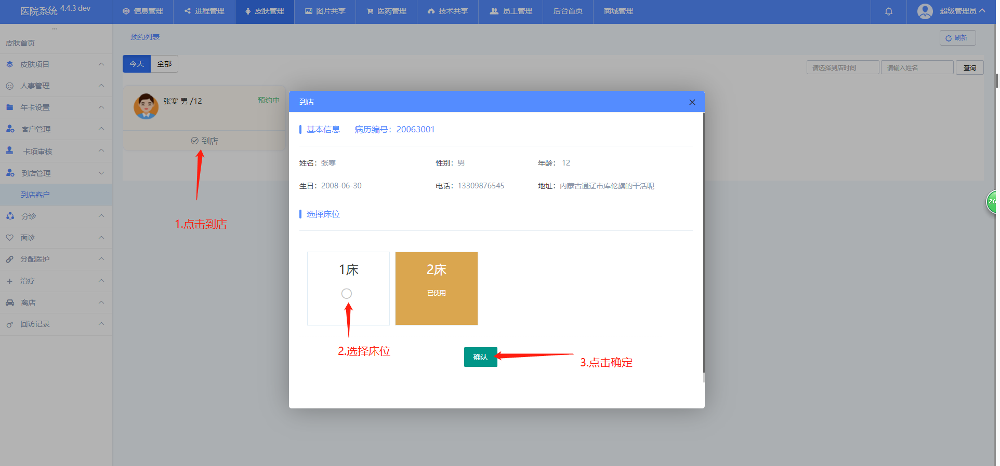
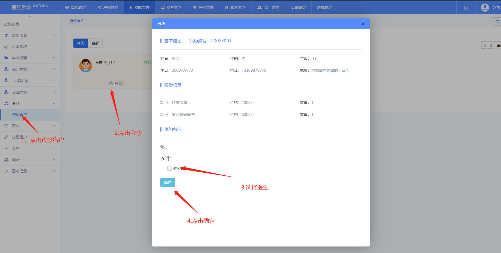
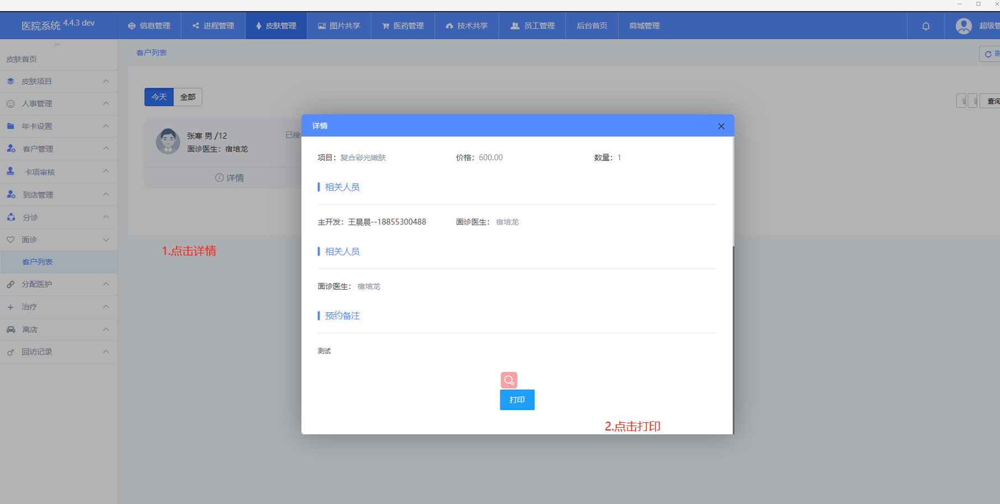
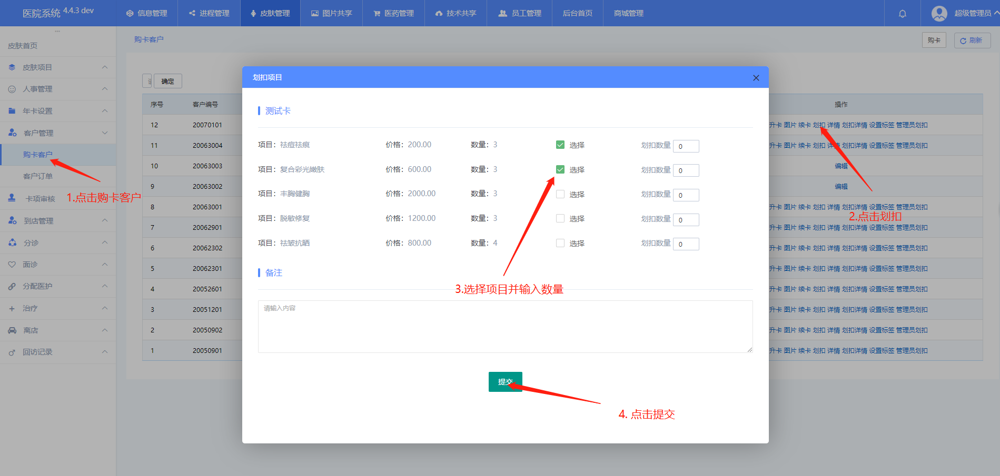
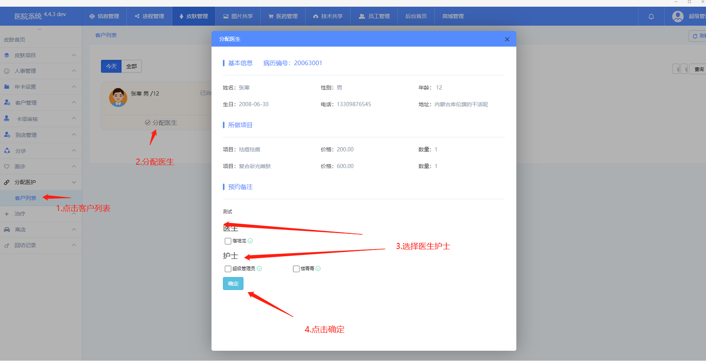
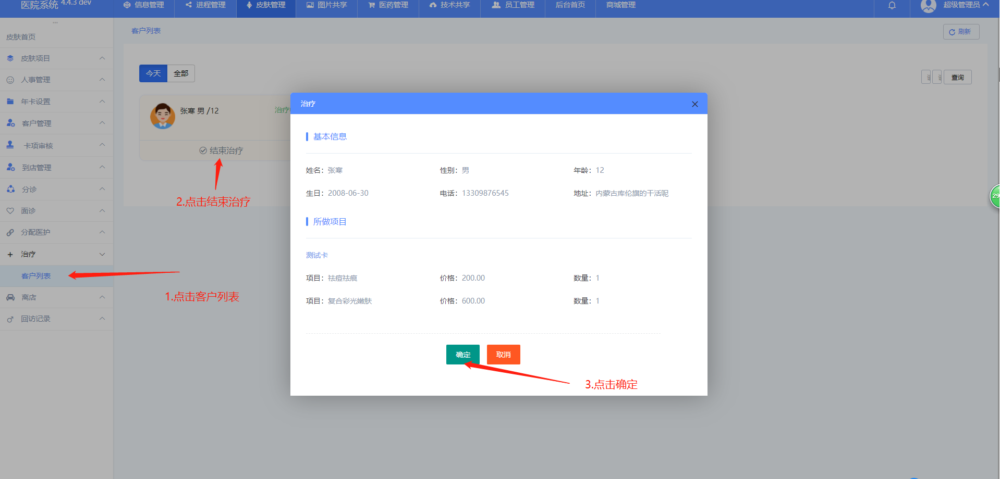
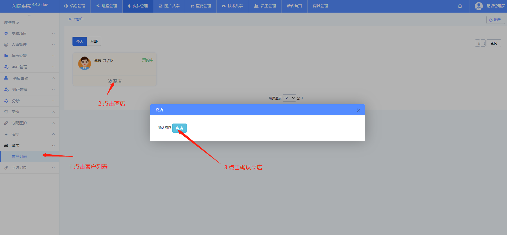

###### 河西美容医院系统文档<br><sup>皮肤管理</sup><br>──<br>**张寒**<br>*2020-06-29*

[TOC]

# 流程

- 

## 购卡（添加客户）

- 权限：销售

- 描述；销售添加客户时分两种情况一是客户买卡二是客户不买卡，

- 操作

  - 添加客户（购卡）

    1. 点击购卡客户

    2. 点击购卡

    3. 填写信息

    4. 点击提交

    5. 图例

       
       
        
       
       


## 预约

- 权限：销售
- 描述：顾客买完卡后要做项目，做项目之前要预约，此步骤在手机上操作


## 到店

1. 权限；前台

2. 描述

   ```javascript
   预约完之后，顾客到前台登记到店
   ```

3. 操作；

   - 到店

     1. 点击到店

     2. 选择床位

     3. 点击确定

     4. 图例

        

## 分诊

- 权限：七楼护士站

- 描述；

  ```javascript
  但客户到店之后需要面诊，但面诊之前需要分配面诊医生，此时由护士站分配医生的工作,具体工作就是分诊
  ```

  

- 操作

  - 分诊

    1. 点击代诊客户

    2. 点击分诊

    3. 选择医生

    4. 点击确定

    5. 图例

       

## 面诊

- 权限：面诊医生

- 描述：

  ```javascript
  分配完面诊医生后，医生会收到要面诊的顾客，这时医生给顾客面诊，确定顾客所做项目，然后打印项目单到前台划扣。
  ```

- 操作

  - 接诊

    1. 点击客户列表

    2. 点击接诊

    3. 选择项目和数量

    4. 点击接诊确认

    5. 图例

       

  - 打印

    1. 点击详情

    2. 点击打印

    3. 图例

       

## 划扣

- 权限：前台、超管

- 描述；

  ```javascript
  客户面诊完，确定所做项目后，需要到前天划扣，也就是说划掉它即将要做的项目
  ```

- 操作

  - 划扣

    1. 点击购卡客户

    2. 点击划扣

    3. 选择项目（和打印的项目单保持一致）

    4. 点击提交

    5. 图例

       

## 分配医护

- 权限：护士站

- 描述：

  ```
  划扣结束就要开始做项目，这时顾客信息推送到护士站由护士站分配医生护士给顾客进行治疗，主要操作就是分配医生护士
  ```

- 操作

  - 分配医护

    1. 点击客户列表

    2. 点击分配医生

    3. 选择医生护士

    4. 点击确定

    5. 图例

       

## 治疗

- 权限：销售

- 描述；

  ```
  分配完医生护士后护士站会通知相应的医生和护士，而这补操作主要是客户做完后，尤销售操作主要目的是腾出床位。
  ```

- 操做

  1. 点击客户列表

  2. 点击结束治疗

  3. 点击确定

  4. 图例

     

## 离店

- 权限：销售

- 描述：

- 操作

  - 离店

    1. 点击客户列表

    2. 点击离店

    3. 点击确定

    4. 图例

       


###### END

